## Funciones básicas de gráficos
_________________________________________________________________________

### Gráficos de dispersión

    library(datasets)
    data(cars)
    head(cars)

    ##   speed dist
    ## 1     4    2
    ## 2     4   10
    ## 3     7    4
    ## 4     7   22
    ## 5     8   16
    ## 6     9   10

    plot(cars$dist ~ cars$speed)

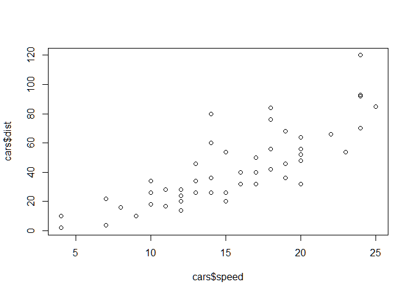

    plot(cars$dist ~ cars$speed, # y~x
      main = "Relación entre distancia y velocidad", # Título
      xlab = "Velocidad (millas por hora)", # Título del eje de X
      ylab = "Distancia recorrida (millas)", # Título del eje de y
      xlim = c(0, 30), # Límite de 0 to 30 del eje de X
      ylim = c(0, 140), # Límite de 0 to 140 del eje de y
      xaxs = "i", # Estilo interno del eje x
      yaxs = "i", # Estilo interno del eje y
      col = "red", # Color de los puntos
      pch = 19
    ) # S?mbolo de los puntos
    grid()
    box()

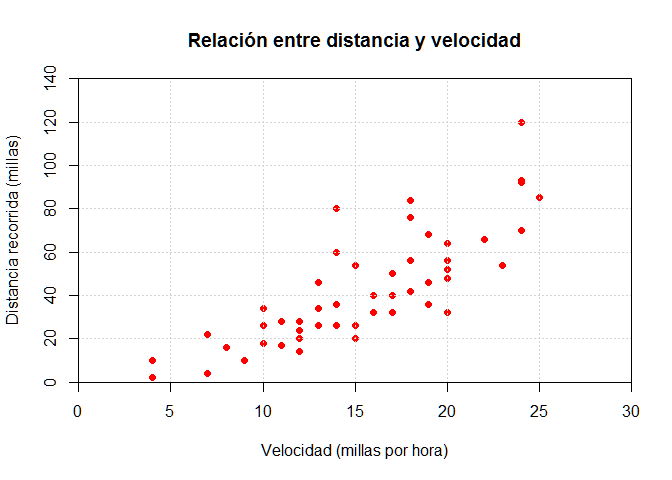 ### Línk de
parámetros gráficos en R
**<http://www.statmethods.net/advgraphs/parameters.html>**

### Gráficos de barra

    library(agridat)

    ## Warning: package 'agridat' was built under R version 4.1.3

    head(harris.multi.uniformity)

    ##   series plot year      crop yield
    ## 1      2    1 1911 sugarbeet 12.78
    ## 2      2    2 1911 sugarbeet 12.70
    ## 3      2    3 1911 sugarbeet 10.04
    ## 4      2    4 1911 sugarbeet 10.35
    ## 5      2    5 1911 sugarbeet  9.33
    ## 6      2    6 1911 sugarbeet  9.40

    mult <- harris.multi.uniformity

    # Gráfico de barras simple
    counts <- table(mult$crop)
    barplot(counts,
      col = "gray50",
      main = "Cosecha",
      xlab = "Número de sitios por cosecha",
      ylim = c(0, 200)
    )

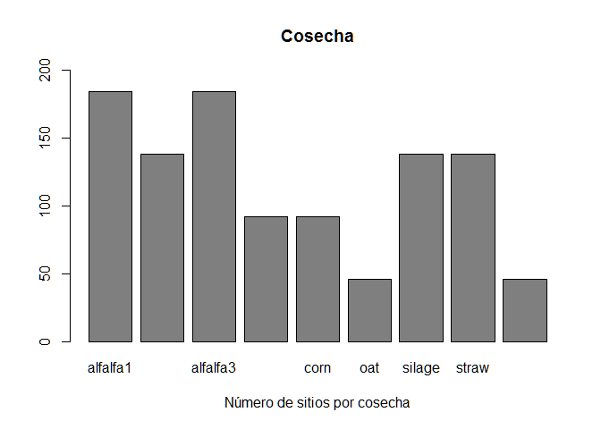

    # x<-par("usr")
    # rect(x[1],x[3],x[2],x[4],col="gray85");grid(col="gray10")

    # Gráfico de barras horizontal
    par(mar = c(4, 5, 2, 2))

    counts <- table(mult$crop)

    barplot(counts,
      main = "Cosecha",
      horiz = TRUE, las = 1,
      xlab = "Número de sitios por cosecha",
      xlim = c(0, 200), col = "black"
    )
    box()

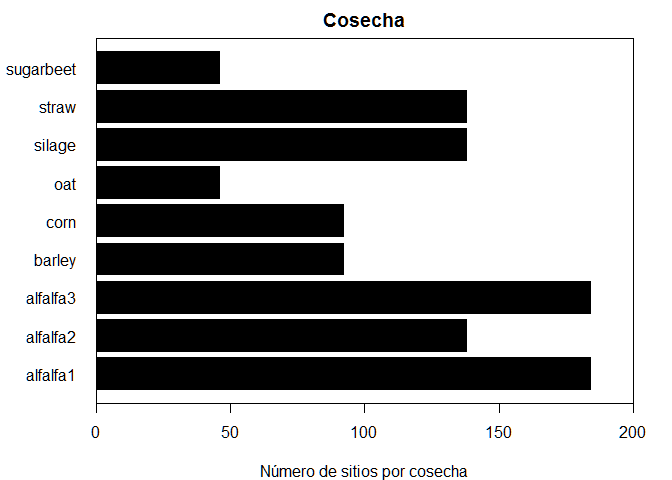

    # Graficos de barras apilados
    counts <- table(mult$series, mult$crop)

    barplot(counts,
      main = "Distribución de cosecha por serie",
      xlab = "Cosechas",
      col = c("darkblue", "red"),
      ylim = c(0, 200),
      legend = rownames(counts)
    )
    box()

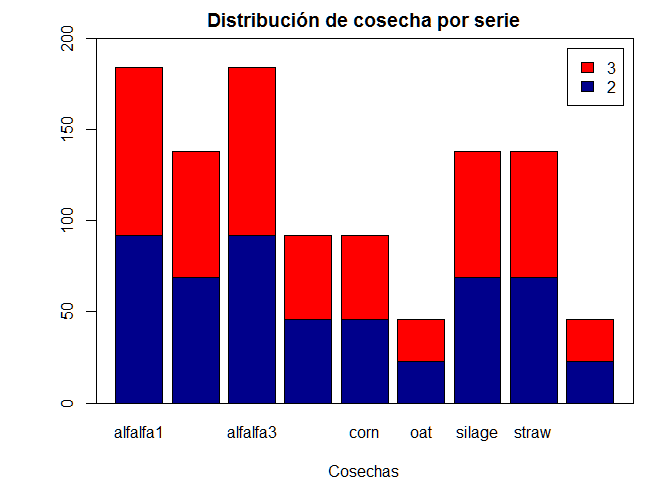

    # Agrupados
    counts <- table(mult$series, mult$crop)
    barplot(counts,
      main = "Distribución de cosecha por serie",
      xlab = "Cosechas", col = c("darkblue", "red"), ylim = c(0, 100),
      legend = rownames(counts), beside = TRUE
    )
    box()

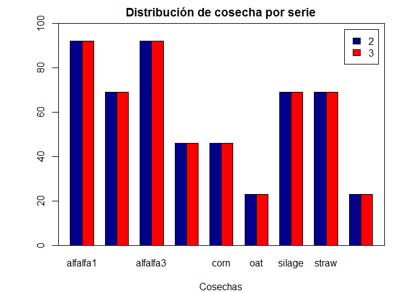

## Distribución de los gráficos en mosaico

    par(mar = c(3, 3, 2, 2))
    par(mfrow = c(2, 2))
    counts <- table(mult$crop)
    barplot(counts,
      col = "gray50",
      main = "Cosecha",
      xlab = "Número de sitios por cosecha",
      ylim = c(0, 200)
    )
    box()

    # Gráfico de barras horizontal
    counts <- table(mult$crop)
    barplot(counts,
      main = "Cosecha", horiz = TRUE, las = 1,
      xlab = "Número de sitios por cosecha", xlim = c(0, 200), col = "black"
    )
    box()

    # Graficos de barras apilados
    counts <- table(mult$series, mult$crop)
    barplot(counts,
      main = "Distribución de cosecha por serie",
      xlab = "Cosechas", col = c("darkblue", "red"), ylim = c(0, 200),
      legend = rownames(counts)
    )
    box()

    # Agrupados
    counts <- table(mult$series, mult$crop)
    barplot(counts,
      main = "Distribución de cosecha por serie",
      xlab = "Cosechas", col = c("darkblue", "red"), ylim = c(0, 100),
      legend = rownames(counts), beside = TRUE
    )
    box()

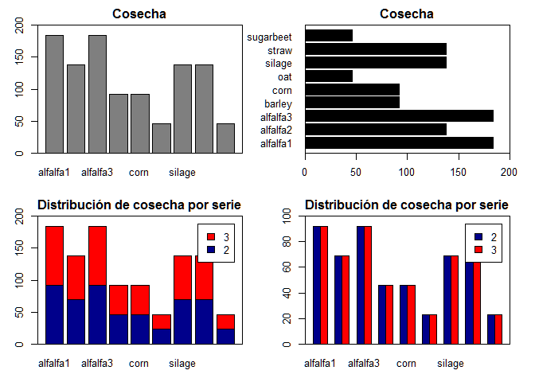

    # dev.off()

### Gráficos de puntos

    library(datasets)
    dotchart(mtcars$mpg,
      labels = row.names(mtcars), cex = .7,
      main = "Millaje por modelo",
      xlab = "Millas por galón"
    )
    panel.first <- grid()
    box("inner")

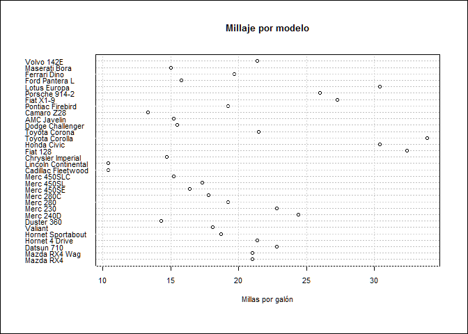

    # Grafico de puntos: Aagrupado, Ordenado y coloreado
    # Ordenado por mpg, grupo y color por cilindraje
    x <- mtcars[order(mtcars$mpg), ] # Ordenado por mpg
    x$cyl <- factor(x$cyl) # con esto se convierte en factor
    x$color[x$cyl == 4] <- "red"
    x$color[x$cyl == 6] <- "blue"
    x$color[x$cyl == 8] <- "darkgreen"
    dotchart(x$mpg,
      labels = row.names(x), cex = .7, groups = x$cyl,
      main = "Millage por modelo de auto\nagrupado por cilindros",
      xlab = "Millas por galón", gcolor = "black", color = x$color
    )
    box("inner")

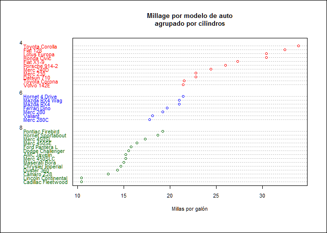

### Gráficos de líneas

    # Crear un gráfico de líneas

    # Convertir de factor a num?rico
    Orange$Tree <- as.numeric(Orange$Tree)
    ntrees <- max(Orange$Tree)

    # Obtener el rango de los ejes x y y
    rangox <- range(Orange$age)
    rangoy <- range(Orange$circumference)

    # llamar el gráfico
    plot(rangox, rangoy,
      type = "n", xlab = "Edad (días)",
      ylab = "Cincurferencia (mm)"
    )
    colors <- rainbow(ntrees)
    linetype <- c(1:ntrees)
    plotchar <- seq(18, 18 + ntrees, 1)

    # add lines
    for (i in 1:ntrees) {
      tree <- subset(Orange, Tree == i)
      lines(tree$age, tree$circumference,
        type = "b", lwd = 1.5,
        lty = linetype[i], col = colors[i], pch = plotchar[i]
      )
    }

    # Título y subTítulo
    title("Crecimiento del árbol", "Ejemplo de gráfico de l?neas")

    # Leyenda
    legend(rangox[1], rangoy[2], 1:ntrees,
      cex = 0.8, col = colors,
      pch = plotchar, lty = linetype, title = "árbol"
    )

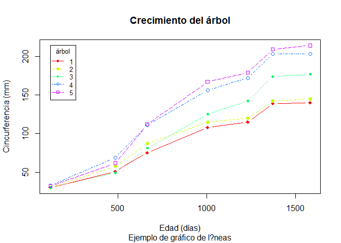

### Gráficos de densidad e histográmas

    datos <- rnorm(1:500, 100, 10)
    res <- hist(datos, plot = F)
    FX <- (res$mids * res$counts)
    tabla <- as.data.frame(cbind(res$mids, res$counts, res$density, FX))
    names(tabla) <- c("Clase", "Frecuencia", "Densidad", "Fx")
    tabla

    ##    Clase Frecuencia Densidad     Fx
    ## 1   72.5          2   0.0008  145.0
    ## 2   77.5          9   0.0036  697.5
    ## 3   82.5         22   0.0088 1815.0
    ## 4   87.5         48   0.0192 4200.0
    ## 5   92.5         68   0.0272 6290.0
    ## 6   97.5         96   0.0384 9360.0
    ## 7  102.5         96   0.0384 9840.0
    ## 8  107.5         69   0.0276 7417.5
    ## 9  112.5         50   0.0200 5625.0
    ## 10 117.5         25   0.0100 2937.5
    ## 11 122.5         11   0.0044 1347.5
    ## 12 127.5          3   0.0012  382.5
    ## 13 132.5          1   0.0004  132.5

    MEDIAF <- ((sum(tabla$Fx) / (sum(tabla$Frecuencia))))
    MEDIAF

    ## [1] 100.38

    # write.csv(tabla,"c:/Curso 1/Tabla de frecuencias.csv")

    hist(datos,
      ylim = c(0, 120), xlim = c(70, 140),
      col = "orange",
      main = "Histograma de frecuencia",
      ylab = "Frecuencia",
      panel.first = grid()
    )
    box()
    box("inner")

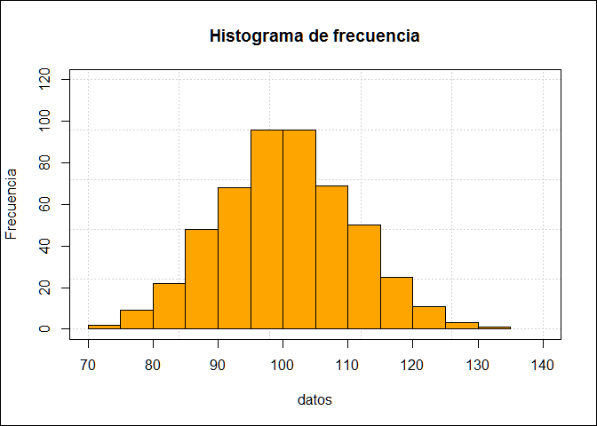

    library(MASS)

    truehist(datos,
      ylim = c(0, 0.05), xlim = c(70, 140),
      col = "gray95",
      main = "Histograma de Densidad",
      ylab = "Densidad", panel.first = grid()
    )
    box()
    box("inner")

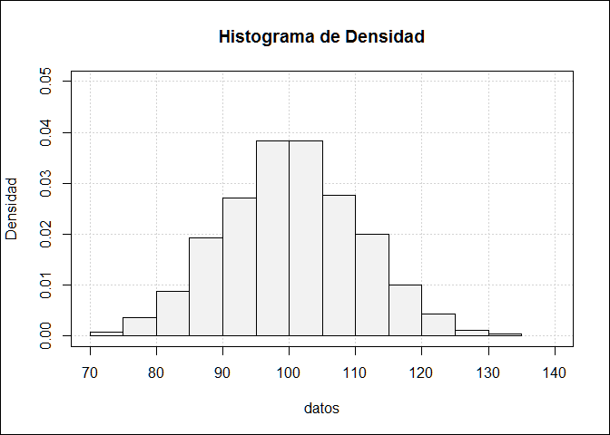

### Gráficos de caja

    head(harris.multi.uniformity)

    ##   series plot year      crop yield
    ## 1      2    1 1911 sugarbeet 12.78
    ## 2      2    2 1911 sugarbeet 12.70
    ## 3      2    3 1911 sugarbeet 10.04
    ## 4      2    4 1911 sugarbeet 10.35
    ## 5      2    5 1911 sugarbeet  9.33
    ## 6      2    6 1911 sugarbeet  9.40

    # Boxplot
    boxplot(yield ~ crop,
      data = harris.multi.uniformity,
      main = "Producción por cosecha",
      xlab = "Tipo de cosecha",
      ylab = "Productividad"
    )

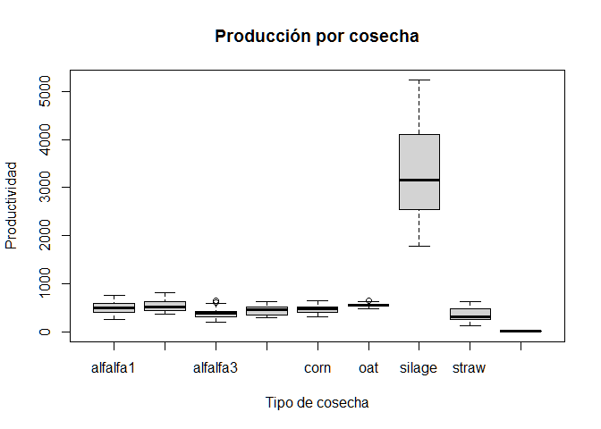

    boxplot(len ~ supp * dose,
      data = ToothGrowth,
      notch = TRUE,
      col = (c("gold", "darkgreen")),
      main = "Crecimiento", xlab = "Dosis"
    )

    ## Warning in (function (z, notch = FALSE, width = NULL, varwidth = FALSE, : some
    ## notches went outside hinges ('box'): maybe set notch=FALSE

------------------------------------------------------------------------

# Gráficos con LATTICE

    require(stats)
    require(graphics)
    require(datasets)
    require(MASS)
    require(lattice)

    ## Loading required package: lattice

    library(agricolae)

    ## Warning: package 'agricolae' was built under R version 4.1.3

    data(corn)
    head(corn)

    ##   method observation   rx
    ## 1      1          83 11.0
    ## 2      1          91 23.0
    ## 3      1          94 28.5
    ## 4      1          89 17.0
    ## 5      1          89 17.0
    ## 6      1          96 31.5

    # write.csv(corn,'c:/Curso 1/MA.csv')
    # MA <- read.csv("c:/Curso 1/MA.csv", header = T)
    # llamar los datos de las primaras filas
    # head(MA)

    # histograma elaborado con la librer?a lattice
    method <- factor(corn$method,
      levels = c(1, 2, 3, 4),
      labels = c("a", "b", "c", "d")
    )

    histogram(corn$rx,
      subset = method == "a",
      col = "orange",
      xlab = "Maíz", ylab = "Porcentaje",
      main = "Datos de Maíz (a)"
    )

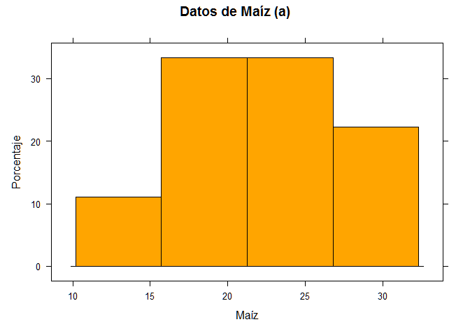

    histogram(corn$rx,
      subset = method == "b",
      col = "blue",
      xlab = "Maíz", ylab = "Proporción",
      main = "Datos de Maíz (b)"
    )

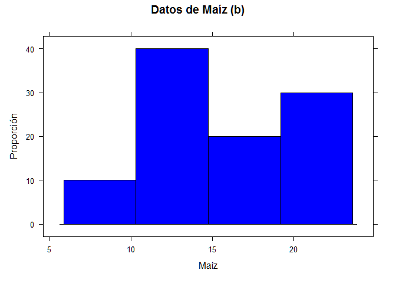

    histogram(corn$rx,
      subset = method == "c",
      col = "White",
      xlab = "Maíz", ylab = "Proporción",
      main = "Datos de Maíz (c)"
    )

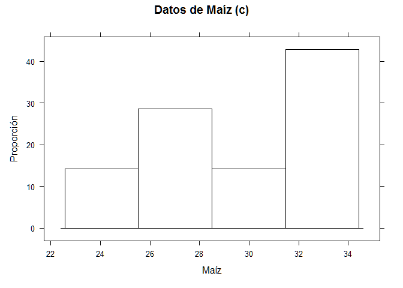

    histogram(corn$rx,
      subset = method == "d",
      col = "Gray85",
      xlab = "Maíz", ylab = "Proporción",
      main = "Datos de Maíz (d)"
    )

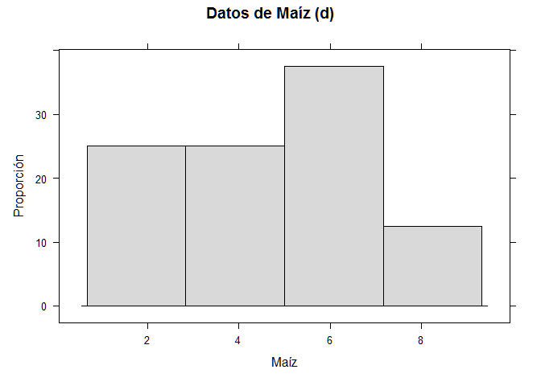

    # Todos juntos
    histogram(~ corn$rx | method,
      col = "Gray85",
      xlab = "Maíz", ylab = "Proporción",
      main = "Datos de Maíz"
    )

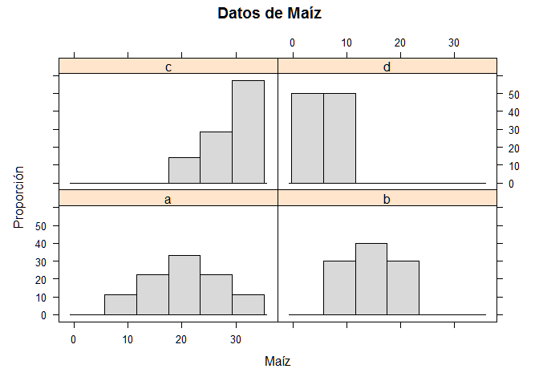

## Utilizando el ejemplo de Kabacoff (2014)

    library(lattice)
    attach(mtcars)
    str(mtcars)

    ## 'data.frame':    32 obs. of  11 variables:
    ##  $ mpg : num  21 21 22.8 21.4 18.7 18.1 14.3 24.4 22.8 19.2 ...
    ##  $ cyl : num  6 6 4 6 8 6 8 4 4 6 ...
    ##  $ disp: num  160 160 108 258 360 ...
    ##  $ hp  : num  110 110 93 110 175 105 245 62 95 123 ...
    ##  $ drat: num  3.9 3.9 3.85 3.08 3.15 2.76 3.21 3.69 3.92 3.92 ...
    ##  $ wt  : num  2.62 2.88 2.32 3.21 3.44 ...
    ##  $ qsec: num  16.5 17 18.6 19.4 17 ...
    ##  $ vs  : num  0 0 1 1 0 1 0 1 1 1 ...
    ##  $ am  : num  1 1 1 0 0 0 0 0 0 0 ...
    ##  $ gear: num  4 4 4 3 3 3 3 4 4 4 ...
    ##  $ carb: num  4 4 1 1 2 1 4 2 2 4 ...

    # Factores con etiquetas
    gear.f <- factor(gear,
      levels = c(3, 4, 5),
      labels = c("3vel", "4vel", "5vel")
    )
    cyl.f <- factor(cyl,
      levels = c(4, 6, 8),
      labels = c("4cyl", "6cyl", "8cyl")
    )

    densityplot(~mpg,
      main = "Gráfico de Densidad",
      xlab = "Millas por galón"
    )

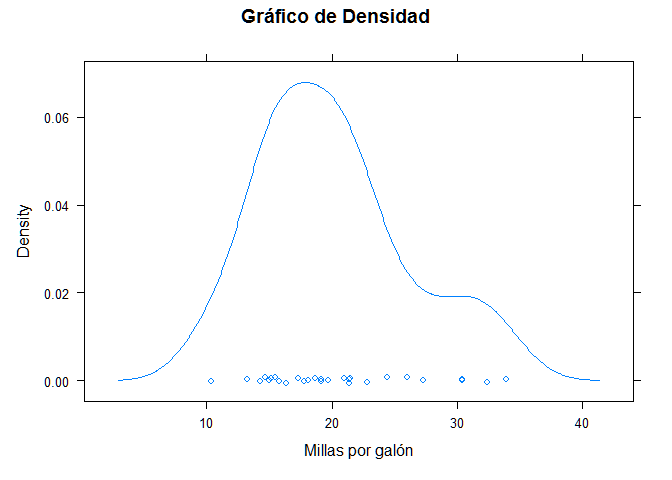

    densityplot(~ mpg | gear.f,
      main = "Densidad por engranaje",
      xlab = "Millas por galón"
    )

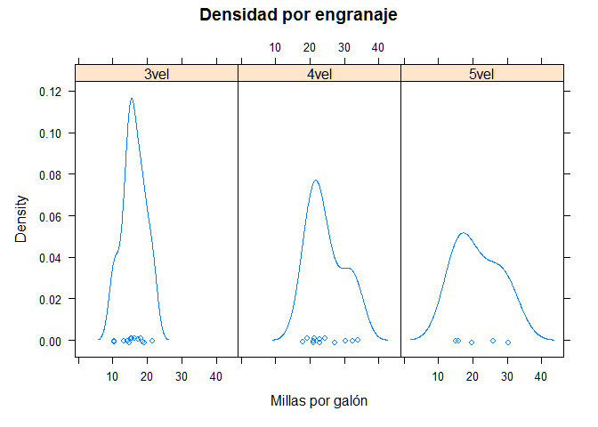

    densityplot(~ mpg | cyl.f,
      main = "Densidad por número de cilindros",
      xlab = "Millas por galón",
      layout = c(1, 3)
    )

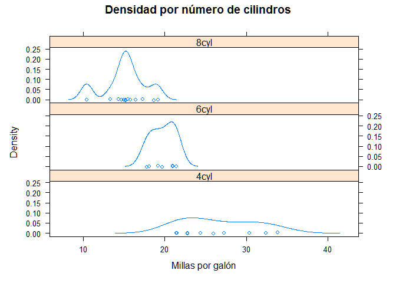

    bwplot(cyl.f ~ mpg | gear.f,
      ylab = "Cilindros", xlab = "Millas por galón",
      main = "Mileage by Cylinders and Gears",
      layout = (c(1, 3))
    )

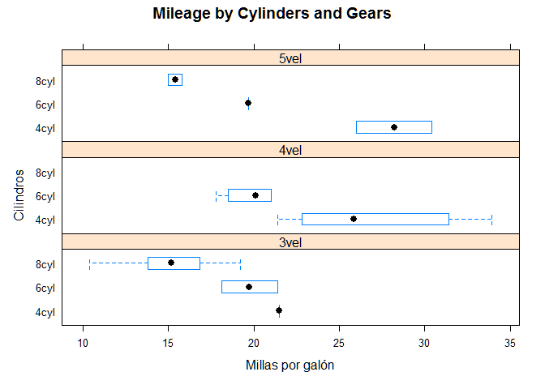

    xyplot(mpg ~ wt | cyl.f * gear.f,
      main = "Scatterplot Cilindros y velocidaes",
      ylab = "Millas por galón", xlab = "Car Weight"
    )

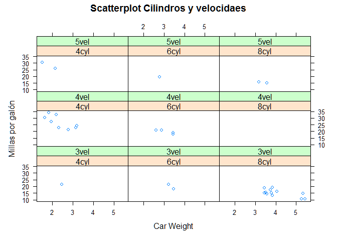

    # 3d scatterplot
    cloud(mpg ~ wt * qsec | cyl.f,
      main = "3D Scatterplot por cilindros"
    )

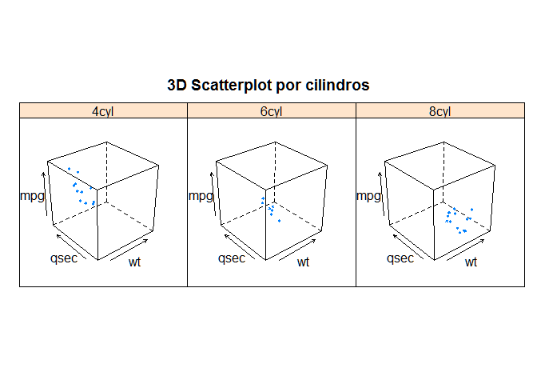

    dotplot(cyl.f ~ mpg | gear.f,
      main = "Puntos por N de cilindros y velocidades",
      xlab = "Millas por galón"
    )

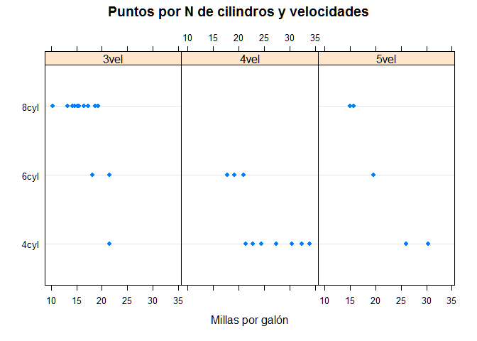

    splom(mtcars[c(1, 3, 4, 5, 6)],
      main = "Datos MTCARS"
    )

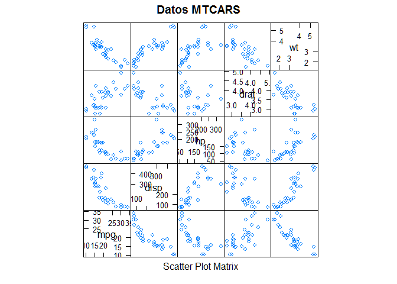

[Contenido del tutorial](https://github.com/rubio-e/Tutorial_R/blob/main/README.md#m%C3%B3dulos)
