Gráficos con R
========================================================

## Funciones básicas de gráficos
### Gráficos de dispersión

```r
library(datasets)
data(cars)
head(cars)
```

```
##   speed dist
## 1     4    2
## 2     4   10
## 3     7    4
## 4     7   22
## 5     8   16
## 6     9   10
```

```r
plot(cars$dist ~ cars$speed)
```

 


```r
plot(cars$dist~cars$speed, # y~x
main="Relación entre distancia y velocidad", # Título
xlab="Velocidad (millas por hora)", # Título del eje de X 
ylab="Distancia recorrida (millas)", #Título del eje de y
xlim=c(0,30), # Límite de 0 to 30 del eje de X 
ylim=c(0,140), #Límite de 0 to 140 del eje de y
xaxs="i", # Estilo interno del eje x
yaxs="i", # Estilo interno del eje y
col="red", # Color de los puntos
pch=19) # Símbolo de los puntos
grid()
box("inner")
```

 

### Línk de parámetros gráficos en R
**http://www.statmethods.net/advgraphs/parameters.html**

### Gráficos de barra

```r
library(agridat)
```

```
## Loading required package: grid
## Loading required package: lattice
## Loading required package: reshape2
```

```r
head(harris.multi.uniformity)
```

```
##   series plot year      crop yield
## 1      2    1 1911 sugarbeet 12.78
## 2      2    2 1911 sugarbeet 12.70
## 3      2    3 1911 sugarbeet 10.04
## 4      2    4 1911 sugarbeet 10.35
## 5      2    5 1911 sugarbeet  9.33
## 6      2    6 1911 sugarbeet  9.40
```

```r
mult <- harris.multi.uniformity

# Gráfico de barras simple
counts <- table(mult$crop)
barplot(counts, col = "gray50", main = "Cosecha", xlab = "Número de sitios por cosecha", 
    ylim = c(0, 200))
box()
```

 

```r

# Gráfico de barras horizontal
counts <- table(mult$crop)

barplot(counts, main = "Cosecha", horiz = TRUE, las = 1, xlab = "Número de sitios por cosecha", 
    xlim = c(0, 200), col = "black")
box()
```

 

```r

# Graficos de barras apilados
counts <- table(mult$series, mult$crop)

barplot(counts, main = "Distribución de cosecha por serie", xlab = "Cosechas", 
    col = c("darkblue", "red"), ylim = c(0, 200), legend = rownames(counts))
box()
```

 

```r


# Agrupados
counts <- table(mult$series, mult$crop)
barplot(counts, main = "Distribución de cosecha por serie", xlab = "Cosechas", 
    col = c("darkblue", "red"), ylim = c(0, 100), legend = rownames(counts), 
    beside = TRUE)
box()
```

 


## Distribución de los gráficos en mosaico


```r
par(mar = c(3, 3, 2, 2))
par(mfrow = c(2, 2))
counts <- table(mult$crop)
barplot(counts, col = "gray50", main = "Cosecha", xlab = "Número de sitios por cosecha", 
    ylim = c(0, 200))
box()

# Gráfico de barras horizontal
counts <- table(mult$crop)
barplot(counts, main = "Cosecha", horiz = TRUE, las = 1, xlab = "Número de sitios por cosecha", 
    xlim = c(0, 200), col = "black")
box()

# Graficos de barras apilados
counts <- table(mult$series, mult$crop)
barplot(counts, main = "Distribución de cosecha por serie", xlab = "Cosechas", 
    col = c("darkblue", "red"), ylim = c(0, 200), legend = rownames(counts))
box()


# Agrupados
counts <- table(mult$series, mult$crop)
barplot(counts, main = "Distribución de cosecha por serie", xlab = "Cosechas", 
    col = c("darkblue", "red"), ylim = c(0, 100), legend = rownames(counts), 
    beside = TRUE)
box()
```

 

```r
dev.off()
```

```
## null device 
##           1
```


### Gráficos de puntos

```r
library(datasets)
dotchart(mtcars$mpg, labels = row.names(mtcars), cex = 0.7, main = "Millaje por modelo", 
    xlab = "Millas por galón")
panel.first = grid()
box("inner")
```

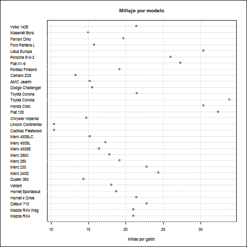 


```r
# Grafico de puntos: Aagrupado, Ordenado y coloreado Ordenado por mpg, grupo
# y color por cilindraje
x <- mtcars[order(mtcars$mpg), ]  # Ordenado por mpg
x$cyl <- factor(x$cyl)  # con esto se convierte en factor
x$color[x$cyl == 4] <- "red"
x$color[x$cyl == 6] <- "blue"
x$color[x$cyl == 8] <- "darkgreen"
dotchart(x$mpg, labels = row.names(x), cex = 0.7, groups = x$cyl, main = "Millage por modelo de auto\nagrupado por cilindros", 
    xlab = "Millas por galón", gcolor = "black", color = x$color)
box("inner")
```

 


### Gráficos de líneas

```r
# Crear un gráfico de líneas

# Convertir de factor a numérico
Orange$Tree <- as.numeric(Orange$Tree)
ntrees <- max(Orange$Tree)

# Obtener el rango de los ejes x y y
rangox <- range(Orange$age)
rangoy <- range(Orange$circumference)

# llamar el gráfico
plot(rangox, rangoy, type = "n", xlab = "Edad (días)", ylab = "Cincurferencia (mm)")
colors <- rainbow(ntrees)
linetype <- c(1:ntrees)
plotchar <- seq(18, 18 + ntrees, 1)

# add lines
for (i in 1:ntrees) {
    tree <- subset(Orange, Tree == i)
    lines(tree$age, tree$circumference, type = "b", lwd = 1.5, lty = linetype[i], 
        col = colors[i], pch = plotchar[i])
}

# Título y subtítulo
title("Crecimiento del árbol", "Ejemplo de gráfico de líneas")
```

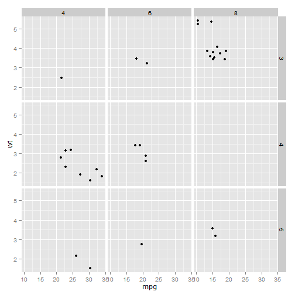 

```r

# Leyenda
legend(xrange[1], yrange[2], 1:ntrees, cex = 0.8, col = colors, pch = plotchar, 
    lty = linetype, title = "Árbol")
```

```
## Error: objeto 'xrange' no encontrado
```


### Gráficos de densidad e histográmas

```r
datos <- rnorm(1:500, 100, 10)
res <- hist(datos, plot = F)
FX <- (res$mids * res$counts)
tabla <- as.data.frame(cbind(res$mids, res$counts, res$density, FX))
names(tabla) <- c("Clase", "Frecuencia", "Densidad", "Fx")
tabla
```

```
##    Clase Frecuencia Densidad      Fx
## 1   77.5          7   0.0028   542.5
## 2   82.5         22   0.0088  1815.0
## 3   87.5         37   0.0148  3237.5
## 4   92.5         73   0.0292  6752.5
## 5   97.5         94   0.0376  9165.0
## 6  102.5        103   0.0412 10557.5
## 7  107.5         79   0.0316  8492.5
## 8  112.5         55   0.0220  6187.5
## 9  117.5         18   0.0072  2115.0
## 10 122.5         10   0.0040  1225.0
## 11 127.5          1   0.0004   127.5
## 12 132.5          1   0.0004   132.5
```

```r
MEDIAF <- ((sum(tabla$Fx)/(sum(tabla$Frecuencia))))
MEDIAF
```

```
## [1] 100.7
```

```r
# write.csv(tabla,'c:/Curso 1/Tabla de frecuencias.csv')

hist(datos, ylim = c(0, 120), xlim = c(70, 140), col = "orange", main = "Histograma de frecuencia", 
    ylab = "Frecuencia", panel.first = grid())
box()
box("inner")
```

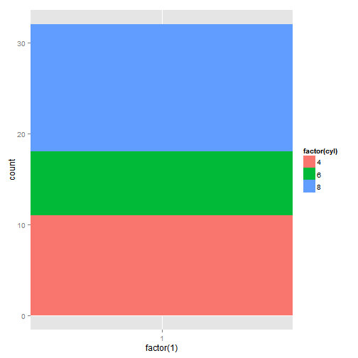 

```r

library(MASS)

truehist(datos, ylim = c(0, 0.05), xlim = c(70, 140), col = "gray95", main = "Histograma de Densidad", 
    ylab = "Densidad", panel.first = grid())
box()
box("inner")
```

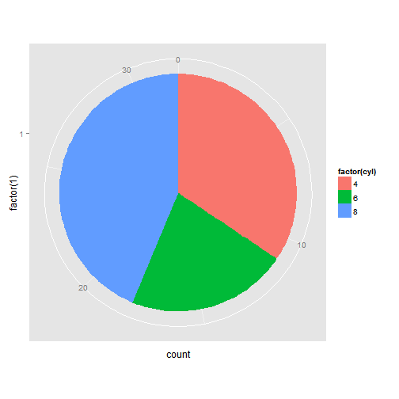 


### Gráficos de caja


```r
head(harris.multi.uniformity)
```

```
##   series plot year      crop yield
## 1      2    1 1911 sugarbeet 12.78
## 2      2    2 1911 sugarbeet 12.70
## 3      2    3 1911 sugarbeet 10.04
## 4      2    4 1911 sugarbeet 10.35
## 5      2    5 1911 sugarbeet  9.33
## 6      2    6 1911 sugarbeet  9.40
```

```r
# Boxplot
boxplot(yield ~ crop, data = harris.multi.uniformity, main = "Producción por cosecha", 
    xlab = "Tipo de cosecha", ylab = "Productividad")
```

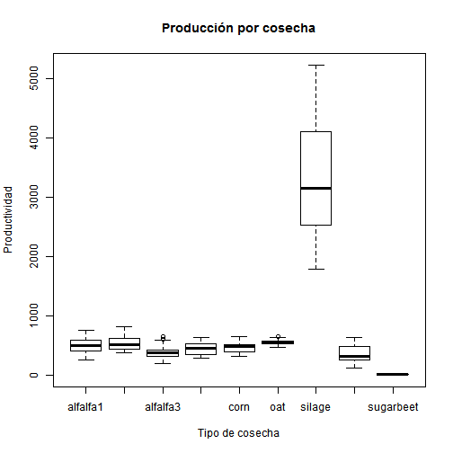 

```r

boxplot(len ~ supp * dose, data = ToothGrowth, notch = TRUE, col = (c("gold", 
    "darkgreen")), main = "Crecimiento", xlab = "Dosis")
```

```
## Warning: some notches went outside hinges ('box'): maybe set notch=FALSE
```

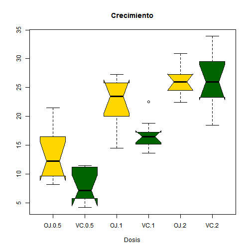 


---
# Gráficos con LATTICE


```r
require(stats)
require(graphics)
require(datasets)
require(MASS)
require(lattice)
```


```r
library(agricolae)
data(corn)
```


```r
# write.csv(corn,'c:/Curso 1/MA.csv')
MA <- read.csv("c:/Curso 1/MA.csv", header = T)
# llamar los datos de las primaras filas
head(MA)
```

```
##   method observation   rx
## 1      a          83 11.0
## 2      a          91 23.0
## 3      a          94 28.5
## 4      a          89 17.0
## 5      a          89 17.0
## 6      a          96 31.5
```


```r
# histograma elaborado con la librería lattice

histogram(MA$rx, subset = MA$method == "a", col = "orange", xlab = "Maíz", ylab = "Porcentaje", 
    main = "Datos de Maíz (a)")
```

 


```r
histogram(MA$rx, subset = MA$method == "b", col = "blue", xlab = "Maíz", ylab = "Proporción", 
    main = "Datos de Maíz (b)")
```

 


```r
histogram(MA$rx, subset = MA$method == "c", col = "White", xlab = "Maíz", ylab = "Proporción", 
    main = "Datos de Maíz (c)")
```

 


```r
histogram(MA$rx, subset = MA$method == "d", col = "Gray85", xlab = "Maíz", ylab = "Proporción", 
    main = "Datos de Maíz (d)")
```

 


```r

# Todos juntos
histogram(~rx | method, data = MA, col = "Gray85", xlab = "Maíz", ylab = "Proporción", 
    main = "Datos de Maíz")
```

 


## Utilizando el ejemplo de Kabacoff (2014)

```r
library(lattice)
attach(mtcars)
# Factores con etiquetas
gear.f <- factor(gear, levels = c(3, 4, 5), labels = c("3vel", "4vel", "5vel"))
cyl.f <- factor(cyl, levels = c(4, 6, 8), labels = c("4cyl", "6cyl", "8cyl"))

densityplot(~mpg, main = "Gráfico de Densidad", xlab = "Millas por galón")
```

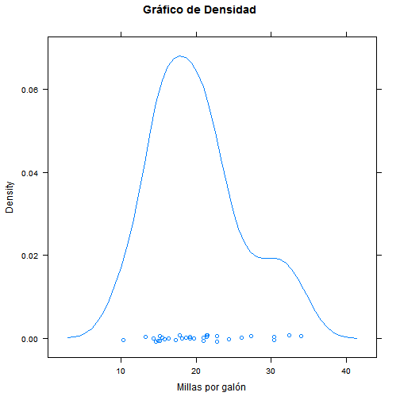 

```r
densityplot(~mpg | gear.f, main = "Densidad por engranaje", xlab = "Millas por galón")
```

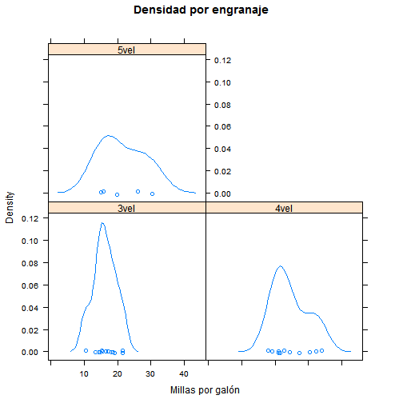 

```r
densityplot(~mpg | cyl.f, main = "Densidad por número de cilindros", xlab = "Millas por galón", 
    layout = c(1, 3))
```

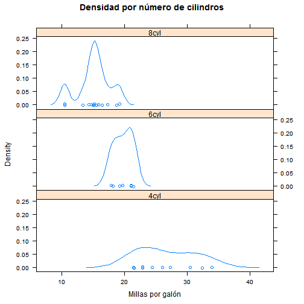 

```r
bwplot(cyl.f ~ mpg | gear.f, ylab = "Cilindros", xlab = "Millas por galón", 
    main = "Mileage by Cylinders and Gears", layout = (c(1, 3)))
```

 

```r
xyplot(mpg ~ wt | cyl.f * gear.f, main = "Scatterplot Cilindros y velocidaes", 
    ylab = "Millas por galón", xlab = "Car Weight")
```

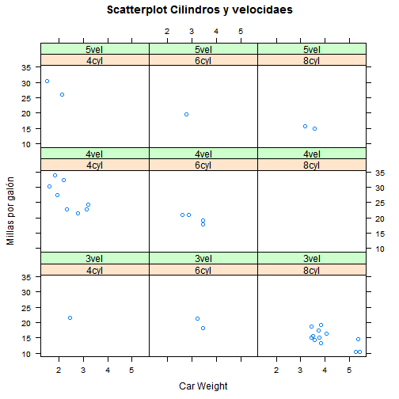 

```r
# 3d scatterplot
cloud(mpg ~ wt * qsec | cyl.f, main = "3D Scatterplot por cilindros")
```

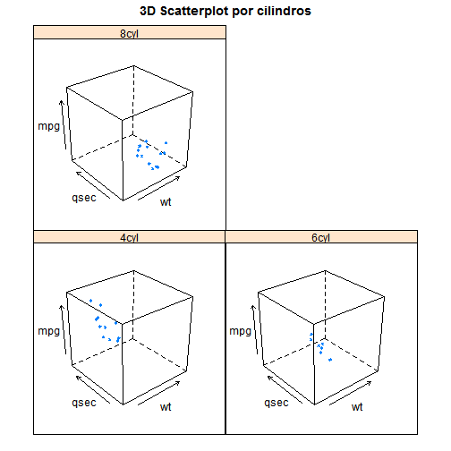 

```r
dotplot(cyl.f ~ mpg | gear.f, main = "Puntos por N de cilindros y velocidades", 
    xlab = "Millas por Galón")
```

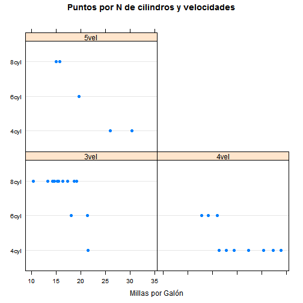 

```r
splom(mtcars[c(1, 3, 4, 5, 6)], main = "Datos MTCARS")
```

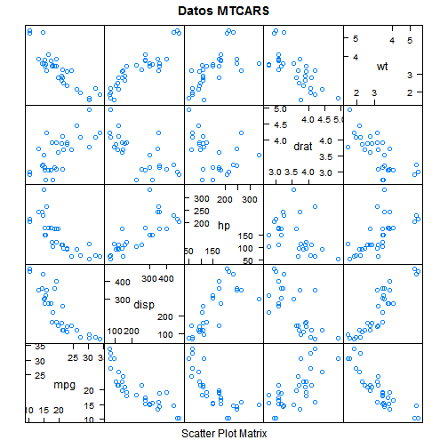 


