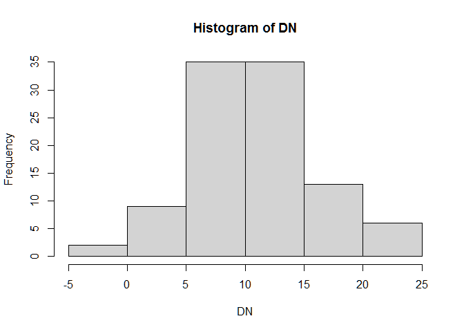
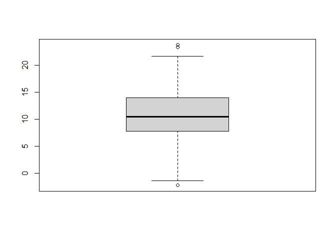
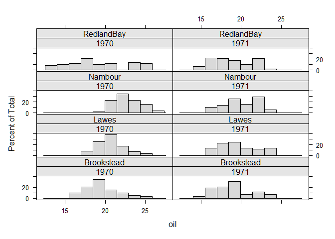
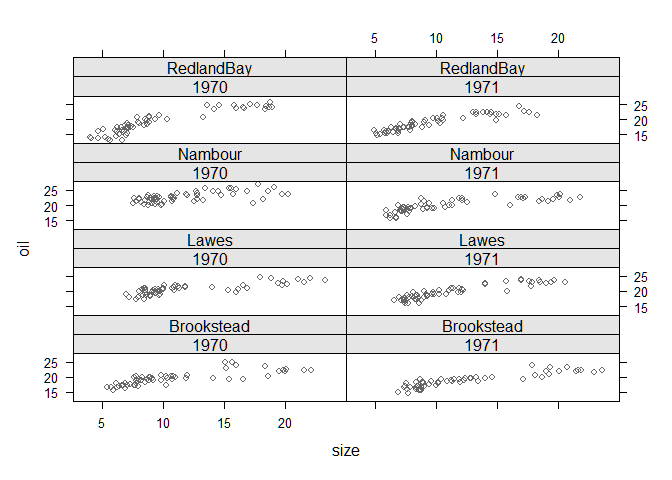
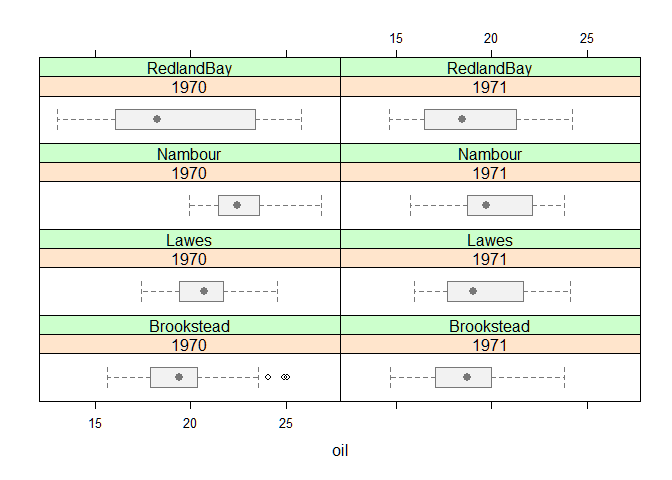
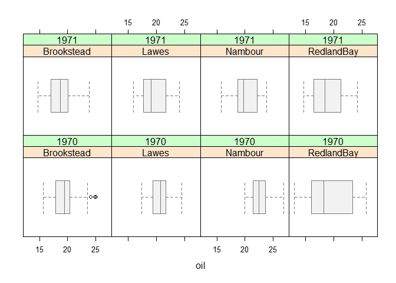

Estadística descriptiva
========================================================

## Medidas de tendencia central

### Media de la pobación


### Media de la muestra


```r

    DN <- rnorm(100, 10, 5) # Generar una base de datos de distribución normal, con 100 datos.
    DN

    ##   [1] 12.173470  2.788278  9.315297 16.673008 16.732262  9.944470  9.405242
    ##   [8]  8.721760 13.175995 15.240090 13.220823 17.355750 10.169845  8.138444
    ##  [15]  9.718768 11.669684  5.523885  9.696670 21.276663 10.258419  9.583156
    ##  [22] 10.674066 14.522970  9.997487  4.358951  8.408870  9.218650 -2.239295
    ##  [29] 14.128093  6.538302 12.392295 13.889586 13.842098 17.250157  9.652020
    ##  [36]  8.696843 18.679302  3.774520 12.411774  8.355805  7.923383 10.537351
    ##  [43]  4.126169 14.684422 15.698038 11.339183  6.823661  7.228301  6.506801
    ##  [50] 14.268998 10.482348  7.619622 23.257263 11.534557  8.530609 11.407360
    ##  [57]  8.890753  4.083384 14.708134  6.613314  5.753610  5.268607 23.710472
    ##  [64]  6.316712 21.644553 15.479131 13.330234 12.425897  6.422877 13.381413
    ##  [71] 20.997933  3.721624 12.749502  9.590959 17.378324  9.009424 13.789917
    ##  [78] 10.057321 15.825647  6.783263 20.181078  7.560593  8.345215  3.807823
    ##  [85] -1.405300 11.603383 13.967310  5.708927 12.625612 13.566049  8.137552
    ##  [92] 18.048468 11.061253 10.406993  3.240402 13.044948 15.929334 15.859211
    ##  [99]  4.124734 11.857317

    hist(DN)
```

```r
    suma <- sum(DN)
    suma

    ## [1] 1092.906

    N <- length(DN)
    N

    ## [1] 100

    MEDIA <- suma / N
    MEDIA

    ## [1] 10.92906

    mean(DN)

    ## [1] 10.92906
```
### Mediana
```r
    quantile(DN, 0.50)

    ##      50% 
    ## 10.44467

    median(DN)

    ## [1] 10.44467
```
### Moda
```r
    library(modeest) # Para calcular la moda en r se requiere del paquete modeest

    ## Warning: package 'modeest' was built under R version 4.1.3

    mlv(DN, method = "mfv")

    ##   [1] -2.239295 -1.405300  2.788278  3.240402  3.721624  3.774520  3.807823
    ##   [8]  4.083384  4.124734  4.126169  4.358951  5.268607  5.523885  5.708927
    ##  [15]  5.753610  6.316712  6.422877  6.506801  6.538302  6.613314  6.783263
    ##  [22]  6.823661  7.228301  7.560593  7.619622  7.923383  8.137552  8.138444
    ##  [29]  8.345215  8.355805  8.408870  8.530609  8.696843  8.721760  8.890753
    ##  [36]  9.009424  9.218650  9.315297  9.405242  9.583156  9.590959  9.652020
    ##  [43]  9.696670  9.718768  9.944470  9.997487 10.057321 10.169845 10.258419
    ##  [50] 10.406993 10.482348 10.537351 10.674066 11.061253 11.339183 11.407360
    ##  [57] 11.534557 11.603383 11.669684 11.857317 12.173470 12.392295 12.411774
    ##  [64] 12.425897 12.625612 12.749502 13.044948 13.175995 13.220823 13.330234
    ##  [71] 13.381413 13.566049 13.789917 13.842098 13.889586 13.967310 14.128093
    ##  [78] 14.268998 14.522970 14.684422 14.708134 15.240090 15.479131 15.698038
    ##  [85] 15.825647 15.859211 15.929334 16.673008 16.732262 17.250157 17.355750
    ##  [92] 17.378324 18.048468 18.679302 20.181078 20.997933 21.276663 21.644553
    ##  [99] 23.257263 23.710472

### Función summary

    summary(DN)

    ##    Min. 1st Qu.  Median    Mean 3rd Qu.    Max. 
    ##  -2.239   7.847  10.445  10.929  13.909  23.710

    boxplot(DN)

## 
```
## Medidas de dispersión

### El rango
```r
    min(DN)

    ## [1] -2.239295

    max(DN)

    ## [1] 23.71047

    R <- (max(DN)) - (min(DN))
    R

    ## [1] 25.94977

    range(DN)

    ## [1] -2.239295 23.710472
```
### La varianza

#### De la población “FINITA”


#### De la muestra

```r
    DN - mean(DN)

    ##   [1]   1.2444055  -8.1407867  -1.6137671   5.7439431   5.8031979  -0.9845950
    ##   [7]  -1.5238227  -2.2073047   2.2469302   4.3110258   2.2917582   6.4266850
    ##  [13]  -0.7592194  -2.7906206  -1.2102966   0.7406192  -5.4051795  -1.2323940
    ##  [19]  10.3475983  -0.6706452  -1.3459083  -0.2549983   3.5939052  -0.9315775
    ##  [25]  -6.5701131  -2.5201942  -1.7104149 -13.1683591   3.1990288  -4.3907626
    ##  [31]   1.4632307   2.9605216   2.9130338   6.3210922  -1.2770448  -2.2322216
    ##  [37]   7.7502380  -7.1545443   1.4827097  -2.5732590  -3.0056815  -0.3917132
    ##  [43]  -6.8028957   3.7553577   4.7689736   0.4101184  -4.1054039  -3.7007636
    ##  [49]  -4.4222632   3.3399331  -0.4467166  -3.3094424  12.3281989   0.6054926
    ##  [55]  -2.3984558   0.4782959  -2.0383115  -6.8456810   3.7790698  -4.3157504
    ##  [61]  -5.1754547  -5.6604578  12.7814074  -4.6123521  10.7154888   4.5500665
    ##  [67]   2.4011692   1.4968323  -4.5061880   2.4523489  10.0688683  -7.2074407
    ##  [73]   1.8204373  -1.3381050   6.4492597  -1.9196403   2.8608527  -0.8717432
    ##  [79]   4.8965827  -4.1458018   9.2520132  -3.3684710  -2.5838491  -7.1212410
    ##  [85] -12.3343642   0.6743181   3.0382456  -5.2201372   1.6965479   2.6369845
    ##  [91]  -2.7915121   7.1194032   0.1321881  -0.5220711  -7.6886626   2.1158833
    ##  [97]   5.0002694   4.9301466  -6.8043301   0.9282526

    (DN - mean(DN))^2

    ##   [1]   1.54854503  66.27240873   2.60424437  32.99288253  33.67710603
    ##   [6]   0.96942722   2.32203564   4.87219390   5.04869542  18.58494327
    ##  [11]   5.25215587  41.30228055   0.57641409   7.78756312   1.46481782
    ##  [16]   0.54851676  29.21596577   1.51879504 107.07279117   0.44976502
    ##  [21]   1.81146906   0.06502413  12.91615433   0.86783660  43.16638595
    ##  [26]   6.35137857   2.92551925 173.40568121  10.23378504  19.27879610
    ##  [31]   2.14104409   8.76468836   8.48576619  39.95620611   1.63084337
    ##  [36]   4.98281322  60.06618903  51.18750404   2.19842814   6.62166181
    ##  [41]   9.03412103   0.15343921  46.27938966  14.10271119  22.74310965
    ##  [46]   0.16819710  16.85434087  13.69565120  19.55641183  11.15515279
    ##  [51]   0.19955575  10.95240868 151.98448890   0.36662129   5.75259031
    ##  [56]   0.22876697   4.15471361  46.86334778  14.28136822  18.62570145
    ##  [61]  26.78533144  32.04078220 163.36437404  21.27379230 114.82170021
    ##  [66]  20.70310494   5.76561372   2.24050704  20.30573000   6.01401513
    ##  [71] 101.38210812  51.94720158   3.31399198   1.79052502  41.59295068
    ##  [76]   3.68501871   8.18447825   0.75993623  23.97652255  17.18767286
    ##  [81]  85.59974801  11.34659675   6.67627608  50.71207350 152.13653963
    ##  [86]   0.45470493   9.23093620  27.24983239   2.87827479   6.95368715
    ##  [91]   7.79253990  50.68590220   0.01747369   0.27255819  59.11553192
    ##  [96]   4.47696221  25.00269419  24.30634573  46.29890858   0.86165282

    sum((DN - mean(DN))^2) # Se calcula el numerador

    ## [1] 2467.495

    length(DN)

    ## [1] 100

    (length(DN) - 1) # el denominador

    ## [1] 99

    varianza <- sum((DN - mean(DN))^2) / ((length(DN)) - 1) # se puede hacer un vector
    varianza

    ## [1] 24.9242

    var(DN) # ó calcular de manera directa mediante la función "var"

    ## [1] 24.9242
```
### La desviación estándar


```r
    sqrt(varianza) # Para el primer ejemplo del cálulo de la varianza

    ## [1] 4.992414

    sqrt(var(DN)) # Para el segundo ejemplo

    ## [1] 4.992414

    sd(DN) # De manera directa sobre la base de datos

    ## [1] 4.992414
```
### El coeficiente de variación


```r
    sd(DN) / mean(DN) * (100)

    ## [1] 45.68016

### Incluso se puede crear un función para el cálculo

    CVAR <- function(x) {
      desviacion <- sd(x)
      media <- mean(x)
      result <- desviacion / media * (100)
      return(result)
    }

    CVAR(DN)

    ## [1] 45.68016
```
# Estadística descriptiva con bases de datos

## Cálculo directo de las estadísticas básicas
```r
    tree <- read.csv("C:/Users/INIFAP-LENOVO/Documents/MEGA/R_1/BDATOS/treedata.csv", header = T)
    head(tree)

    ##         plotID       date plotsize  spcode       species cover   utme    utmn
    ## 1 ATBN-01-0403 08-28-2001     1000 ABIEFRA Abies fraseri     1 275736 3942439
    ## 2 ATBN-01-0532 07-24-2002     1000 ABIEFRA Abies fraseri     8 302847 3942772
    ## 3 ATBN-01-0533 07-24-2002     1000 ABIEFRA Abies fraseri     3 303037 3943039
    ## 4 ATBN-01-0536 07-25-2002     1000 ABIEFRA Abies fraseri     3 273927 3935488
    ## 5 ATBP-01-0001 05/11/1999    10000 ABIEFRA Abies fraseri     8 273857 3937870
    ## 6 ATBP-01-0005 08-25-1999    10000 ABIEFRA Abies fraseri     4 273876 3935462
    ##   elev      tci streamdist disturb      beers
    ## 1 1660 5.701460      490.9 CORPLOG 0.22442864
    ## 2 1712 3.823586      454.0  VIRGIN 0.83408785
    ## 3 1722 3.893762      453.4  LT-SEL 1.33325863
    ## 4 1754 3.145527      492.5  SETTLE 1.47124839
    ## 5 1945 5.682065      492.4  VIRGIN 1.64377141
    ## 6 1751 5.417182      545.9  SETTLE 0.00032873

    length(tree$cover)

    ## [1] 8971

    sum(tree$cover)

    ## [1] 35938

    mean(tree$cover)

    ## [1] 4.006019

    var(tree$cover)

    ## [1] 4.429841

    sd(tree$cover)

    ## [1] 2.104719

    median(tree$cover)

    ## [1] 4

    min(tree$cover)

    ## [1] 1

    max(tree$cover)

    ## [1] 10

    range(tree$cover)

    ## [1]  1 10
```
## Uso de las función “tapply” para bases de datos por grupo
```r
    tapply(tree$cover, tree$spcode, sum) # calcula la suma de la cobertura por especie

    ##  ABIEFRA  ACERNEG  ACERNIG  ACERRUB  AILAALT  BETUALL  BETULEN  BETUNIG 
    ##      478        7        5     4109        9     2163     1564        3 
    ##  CARYALB  CARYCOR  CARYGLA  CARYOVT  CASTDNT  CATASPE  CLADKEN  DIOSVIR 
    ##      628      278      890       67      763        4       20       95 
    ##  FAGUGRA  FRAXAME  FRAXPEN  JUGLCIN  JUGLNIG  JUNIVIR  LIQUSTY  LIRITUL 
    ##     1695      922       41       18       79       40      198     2159 
    ##  MAGNACU  MAGNFRA  MAGNTRI  NYSSSYL  PAULTOM  PICERUB  PINUECH  PINUPUN 
    ##      656     1268       25     1688        4      688       91      343 
    ##  PINURIG  PINUSTR  PINUVIR  PLATOCC  QUERALB  QUERFLC  QUERIMB  QUERMON 
    ##      805     1276      727       99     1096      110       14     1876 
    ##  QUERMUE  QUERRUB  QUERSTE  QUERVEL  ROBIPSE  SALINIG  TILIAME TILIAMEH 
    ##        9     2452       41      815      957       38      263      721 
    ##  TSUGCAN  TSUGCAR  ULMUALA  ULMUAME  ULMURUB 
    ##     3476        5       16       13      131

    tapply(tree$cover, tree$spcode, mean)

    ##  ABIEFRA  ACERNEG  ACERNIG  ACERRUB  AILAALT  BETUALL  BETULEN  BETUNIG 
    ## 4.686275 3.500000 5.000000 5.168553 9.000000 4.904762 4.148541 1.500000 
    ##  CARYALB  CARYCOR  CARYGLA  CARYOVT  CASTDNT  CATASPE  CLADKEN  DIOSVIR 
    ## 3.450549 2.504505 3.345865 3.722222 2.501639 1.000000 2.857143 1.979167 
    ##  FAGUGRA  FRAXAME  FRAXPEN  JUGLCIN  JUGLNIG  JUNIVIR  LIQUSTY  LIRITUL 
    ## 4.124088 2.945687 2.562500 2.571429 3.038462 1.818182 4.040816 4.184109 
    ##  MAGNACU  MAGNFRA  MAGNTRI  NYSSSYL  PAULTOM  PICERUB  PINUECH  PINUPUN 
    ## 2.915556 3.170000 2.500000 3.801802 1.333333 4.300000 3.500000 4.900000 
    ##  PINURIG  PINUSTR  PINUVIR  PLATOCC  QUERALB  QUERFLC  QUERIMB  QUERMON 
    ## 4.375000 3.656160 4.251462 4.125000 4.000000 3.793103 3.500000 5.002667 
    ##  QUERMUE  QUERRUB  QUERSTE  QUERVEL  ROBIPSE  SALINIG  TILIAME TILIAMEH 
    ## 2.250000 4.026273 4.100000 3.424370 3.117264 4.222222 4.109375 4.396341 
    ##  TSUGCAN  TSUGCAR  ULMUALA  ULMUAME  ULMURUB 
    ## 4.659517 2.500000 2.285714 3.250000 3.540541

    tapply(tree$cover, tree$spcode, median)

    ##  ABIEFRA  ACERNEG  ACERNIG  ACERRUB  AILAALT  BETUALL  BETULEN  BETUNIG 
    ##      4.0      3.5      5.0      6.0      9.0      5.0      4.0      1.5 
    ##  CARYALB  CARYCOR  CARYGLA  CARYOVT  CASTDNT  CATASPE  CLADKEN  DIOSVIR 
    ##      3.0      2.0      3.0      3.0      2.0      1.0      2.0      2.0 
    ##  FAGUGRA  FRAXAME  FRAXPEN  JUGLCIN  JUGLNIG  JUNIVIR  LIQUSTY  LIRITUL 
    ##      4.0      3.0      2.0      2.0      3.0      2.0      3.0      4.0 
    ##  MAGNACU  MAGNFRA  MAGNTRI  NYSSSYL  PAULTOM  PICERUB  PINUECH  PINUPUN 
    ##      2.0      3.0      2.5      4.0      1.0      4.0      3.0      4.5 
    ##  PINURIG  PINUSTR  PINUVIR  PLATOCC  QUERALB  QUERFLC  QUERIMB  QUERMON 
    ##      4.0      3.0      4.0      4.0      4.0      4.0      2.0      5.0 
    ##  QUERMUE  QUERRUB  QUERSTE  QUERVEL  ROBIPSE  SALINIG  TILIAME TILIAMEH 
    ##      2.0      4.0      4.0      3.0      3.0      3.0      4.0      5.0 
    ##  TSUGCAN  TSUGCAR  ULMUALA  ULMUAME  ULMURUB 
    ##      4.0      2.5      2.0      2.5      3.0

    tapply(tree$cover, tree$spcode, var)

    ##    ABIEFRA    ACERNEG    ACERNIG    ACERRUB    AILAALT    BETUALL    BETULEN 
    ##  4.7124830  0.5000000         NA  4.1680275         NA  3.6227273  4.3129832 
    ##    BETUNIG    CARYALB    CARYCOR    CARYGLA    CARYOVT    CASTDNT    CATASPE 
    ##  0.5000000  3.0445025  2.4886159  2.9138885  2.3300654  1.6192407  0.0000000 
    ##    CLADKEN    DIOSVIR    FAGUGRA    FRAXAME    FRAXPEN    JUGLCIN    JUGLNIG 
    ##  3.1428571  0.9144504  4.8650525  2.7951176  1.4625000  0.9523810  2.3584615 
    ##    JUNIVIR    LIQUSTY    LIRITUL    MAGNACU    MAGNFRA    MAGNTRI    NYSSSYL 
    ##  0.3463203  6.4566327  5.1485625  2.6044444  3.1339348  1.1666667  2.9854595 
    ##    PAULTOM    PICERUB    PINUECH    PINUPUN    PINURIG    PINUSTR    PINUVIR 
    ##  0.3333333  4.2993711  1.2200000  3.5695652  3.5580601  3.5308599  3.9893361 
    ##    PLATOCC    QUERALB    QUERFLC    QUERIMB    QUERMON    QUERMUE    QUERRUB 
    ##  2.7228261  5.1208791  5.0270936 14.3333333  4.4946453  0.2500000  5.4598349 
    ##    QUERSTE    QUERVEL    ROBIPSE    SALINIG    TILIAME   TILIAMEH    TSUGCAN 
    ##  1.6555556  3.2748466  2.7443742  8.4444444  4.7973710  3.6885755  4.4718355 
    ##    TSUGCAR    ULMUALA    ULMUAME    ULMURUB 
    ##  0.5000000  0.2380952  3.5833333  1.5330330

    tapply(tree$cover, tree$spcode, sd)

    ##   ABIEFRA   ACERNEG   ACERNIG   ACERRUB   AILAALT   BETUALL   BETULEN   BETUNIG 
    ## 2.1708254 0.7071068        NA 2.0415748        NA 1.9033463 2.0767723 0.7071068 
    ##   CARYALB   CARYCOR   CARYGLA   CARYOVT   CASTDNT   CATASPE   CLADKEN   DIOSVIR 
    ## 1.7448503 1.5775348 1.7070116 1.5264552 1.2724939 0.0000000 1.7728105 0.9562690 
    ##   FAGUGRA   FRAXAME   FRAXPEN   JUGLCIN   JUGLNIG   JUNIVIR   LIQUSTY   LIRITUL 
    ## 2.2056864 1.6718605 1.2093387 0.9759001 1.5357283 0.5884899 2.5409905 2.2690444 
    ##   MAGNACU   MAGNFRA   MAGNTRI   NYSSSYL   PAULTOM   PICERUB   PINUECH   PINUPUN 
    ## 1.6138291 1.7702923 1.0801234 1.7278482 0.5773503 2.0734925 1.1045361 1.8893293 
    ##   PINURIG   PINUSTR   PINUVIR   PLATOCC   QUERALB   QUERFLC   QUERIMB   QUERMON 
    ## 1.8862821 1.8790583 1.9973322 1.6500988 2.2629360 2.2421181 3.7859389 2.1200578 
    ##   QUERMUE   QUERRUB   QUERSTE   QUERVEL   ROBIPSE   SALINIG   TILIAME  TILIAMEH 
    ## 0.5000000 2.3366290 1.2866839 1.8096537 1.6566153 2.9059326 2.1902902 1.9205665 
    ##   TSUGCAN   TSUGCAR   ULMUALA   ULMUAME   ULMURUB 
    ## 2.1146715 0.7071068 0.4879500 1.8929694 1.2381571

    tapply(tree$cover, tree$spcode, min)

    ##  ABIEFRA  ACERNEG  ACERNIG  ACERRUB  AILAALT  BETUALL  BETULEN  BETUNIG 
    ##        1        3        5        1        9        1        1        1 
    ##  CARYALB  CARYCOR  CARYGLA  CARYOVT  CASTDNT  CATASPE  CLADKEN  DIOSVIR 
    ##        1        1        1        1        1        1        1        1 
    ##  FAGUGRA  FRAXAME  FRAXPEN  JUGLCIN  JUGLNIG  JUNIVIR  LIQUSTY  LIRITUL 
    ##        1        1        1        2        1        1        1        1 
    ##  MAGNACU  MAGNFRA  MAGNTRI  NYSSSYL  PAULTOM  PICERUB  PINUECH  PINUPUN 
    ##        1        1        1        1        1        1        1        1 
    ##  PINURIG  PINUSTR  PINUVIR  PLATOCC  QUERALB  QUERFLC  QUERIMB  QUERMON 
    ##        1        1        1        2        1        1        1        1 
    ##  QUERMUE  QUERRUB  QUERSTE  QUERVEL  ROBIPSE  SALINIG  TILIAME TILIAMEH 
    ##        2        1        3        1        1        2        1        1 
    ##  TSUGCAN  TSUGCAR  ULMUALA  ULMUAME  ULMURUB 
    ##        1        2        2        2        1

    tapply(tree$cover, tree$spcode, max)

    ##  ABIEFRA  ACERNEG  ACERNIG  ACERRUB  AILAALT  BETUALL  BETULEN  BETUNIG 
    ##        9        4        5       10        9        9        9        2 
    ##  CARYALB  CARYCOR  CARYGLA  CARYOVT  CASTDNT  CATASPE  CLADKEN  DIOSVIR 
    ##        9        7        9        6        7        1        5        6 
    ##  FAGUGRA  FRAXAME  FRAXPEN  JUGLCIN  JUGLNIG  JUNIVIR  LIQUSTY  LIRITUL 
    ##       10        9        6        4        8        3        9       10 
    ##  MAGNACU  MAGNFRA  MAGNTRI  NYSSSYL  PAULTOM  PICERUB  PINUECH  PINUPUN 
    ##        9        9        4        9        2        9        6        9 
    ##  PINURIG  PINUSTR  PINUVIR  PLATOCC  QUERALB  QUERFLC  QUERIMB  QUERMON 
    ##       10        9        9        8        9        8        9        9 
    ##  QUERMUE  QUERRUB  QUERSTE  QUERVEL  ROBIPSE  SALINIG  TILIAME TILIAMEH 
    ##        3        9        7        9        9        9       10        9 
    ##  TSUGCAN  TSUGCAR  ULMUALA  ULMUAME  ULMURUB 
    ##       10        3        3        6        7

    tapply(tree$cover, tree$spcode, quantile, c(0.25))

    ##  ABIEFRA  ACERNEG  ACERNIG  ACERRUB  AILAALT  BETUALL  BETULEN  BETUNIG 
    ##     3.00     3.25     5.00     4.00     9.00     4.00     2.00     1.25 
    ##  CARYALB  CARYCOR  CARYGLA  CARYOVT  CASTDNT  CATASPE  CLADKEN  DIOSVIR 
    ##     2.00     1.00     2.00     3.00     2.00     1.00     1.50     1.00 
    ##  FAGUGRA  FRAXAME  FRAXPEN  JUGLCIN  JUGLNIG  JUNIVIR  LIQUSTY  LIRITUL 
    ##     2.00     2.00     2.00     2.00     2.00     1.25     2.00     2.00 
    ##  MAGNACU  MAGNFRA  MAGNTRI  NYSSSYL  PAULTOM  PICERUB  PINUECH  PINUPUN 
    ##     2.00     2.00     2.00     3.00     1.00     3.00     3.00     4.00 
    ##  PINURIG  PINUSTR  PINUVIR  PLATOCC  QUERALB  QUERFLC  QUERIMB  QUERMON 
    ##     3.00     2.00     3.00     3.00     2.00     2.00     1.00     4.00 
    ##  QUERMUE  QUERRUB  QUERSTE  QUERVEL  ROBIPSE  SALINIG  TILIAME TILIAMEH 
    ##     2.00     2.00     3.00     2.00     2.00     2.00     2.00     3.00 
    ##  TSUGCAN  TSUGCAR  ULMUALA  ULMUAME  ULMURUB 
    ##     3.00     2.25     2.00     2.00     3.00

    tapply(tree$cover, tree$spcode, quantile, c(0.50))

    ##  ABIEFRA  ACERNEG  ACERNIG  ACERRUB  AILAALT  BETUALL  BETULEN  BETUNIG 
    ##      4.0      3.5      5.0      6.0      9.0      5.0      4.0      1.5 
    ##  CARYALB  CARYCOR  CARYGLA  CARYOVT  CASTDNT  CATASPE  CLADKEN  DIOSVIR 
    ##      3.0      2.0      3.0      3.0      2.0      1.0      2.0      2.0 
    ##  FAGUGRA  FRAXAME  FRAXPEN  JUGLCIN  JUGLNIG  JUNIVIR  LIQUSTY  LIRITUL 
    ##      4.0      3.0      2.0      2.0      3.0      2.0      3.0      4.0 
    ##  MAGNACU  MAGNFRA  MAGNTRI  NYSSSYL  PAULTOM  PICERUB  PINUECH  PINUPUN 
    ##      2.0      3.0      2.5      4.0      1.0      4.0      3.0      4.5 
    ##  PINURIG  PINUSTR  PINUVIR  PLATOCC  QUERALB  QUERFLC  QUERIMB  QUERMON 
    ##      4.0      3.0      4.0      4.0      4.0      4.0      2.0      5.0 
    ##  QUERMUE  QUERRUB  QUERSTE  QUERVEL  ROBIPSE  SALINIG  TILIAME TILIAMEH 
    ##      2.0      4.0      4.0      3.0      3.0      3.0      4.0      5.0 
    ##  TSUGCAN  TSUGCAR  ULMUALA  ULMUAME  ULMURUB 
    ##      4.0      2.5      2.0      2.5      3.0

    tapply(tree$cover, tree$spcode, quantile, c(0.75))

    ##  ABIEFRA  ACERNEG  ACERNIG  ACERRUB  AILAALT  BETUALL  BETULEN  BETUNIG 
    ##     6.75     3.75     5.00     7.00     9.00     6.00     5.00     1.75 
    ##  CARYALB  CARYCOR  CARYGLA  CARYOVT  CASTDNT  CATASPE  CLADKEN  DIOSVIR 
    ##     5.00     3.00     5.00     4.75     3.00     1.00     4.50     2.00 
    ##  FAGUGRA  FRAXAME  FRAXPEN  JUGLCIN  JUGLNIG  JUNIVIR  LIQUSTY  LIRITUL 
    ##     6.00     4.00     3.00     3.00     3.75     2.00     5.00     6.00 
    ##  MAGNACU  MAGNFRA  MAGNTRI  NYSSSYL  PAULTOM  PICERUB  PINUECH  PINUPUN 
    ##     4.00     4.00     3.00     5.00     1.50     6.00     4.00     6.00 
    ##  PINURIG  PINUSTR  PINUVIR  PLATOCC  QUERALB  QUERFLC  QUERIMB  QUERMON 
    ##     6.00     5.00     6.00     5.00     6.00     6.00     4.50     7.00 
    ##  QUERMUE  QUERRUB  QUERSTE  QUERVEL  ROBIPSE  SALINIG  TILIAME TILIAMEH 
    ##     2.25     6.00     4.75     5.00     4.00     5.00     6.00     6.00 
    ##  TSUGCAN  TSUGCAR  ULMUALA  ULMUAME  ULMURUB 
    ##     7.00     2.75     2.50     3.75     4.00

    # cbind(s,med) # cbind sirve para combinar en un dataframe las variales generadas
```
## Uso del paquete “doBy” para bases de datos
```r
    library(doBy)

    ## Warning: package 'doBy' was built under R version 4.1.3

    CARB <- read.csv("C:/Users/INIFAP-LENOVO/Documents/MEGA/R_1/BDATOS/Captura.csv", header = T)
    head(CARB)

    ##   Planta Origen Tratamiento Conc Captura
    ## 1    Qn1 Quebec    Sin cong   95    16.0
    ## 2    Qn1 Quebec    Sin cong  175    30.4
    ## 3    Qn1 Quebec    Sin cong  250    34.8
    ## 4    Qn1 Quebec    Sin cong  350    37.2
    ## 5    Qn1 Quebec    Sin cong  500    35.3
    ## 6    Qn1 Quebec    Sin cong  675    39.2

    COFUN <- function(x) {
      c(m = mean(x), sd = sd(x), cv = CVAR(x))
    }
    PT <- summaryBy(Captura ~ Planta + Tratamiento, data = CARB, FUN = COFUN)
    PT

    ##    Planta Tratamiento Captura.m Captura.sd Captura.cv
    ## 1     Mc1        cong  18.00000   4.118657   22.88143
    ## 2     Mc2        cong  12.14286   2.186974   18.01038
    ## 3     Mc3        cong  17.30000   3.049044   17.62453
    ## 4     Mn1    Sin cong  26.40000   8.694251   32.93277
    ## 5     Mn2    Sin cong  27.34286   7.652855   27.98850
    ## 6     Mn3    Sin cong  24.11429   6.484707   26.89156
    ## 7     Qc1        cong  29.97143   8.334609   27.80852
    ## 8     Qc2        cong  32.70000  11.336960   34.66960
    ## 9     Qc3        cong  32.58571  10.321083   31.67364
    ## 10    Qn1    Sin cong  33.22857   8.214766   24.72200
    ## 11    Qn2    Sin cong  35.15714  11.004069   31.29967
    ## 12    Qn3    Sin cong  37.61429  10.349948   27.51600

    # write.csv(PT,"c:/Curso 1/PT.csv")
```
```r
    library(agridat)

    ## Warning: package 'agridat' was built under R version 4.1.3

    prueba <- (australia.soybean)
    head(prueba)

    ##   env   loc year gen yield height lodging  size protein    oil
    ## 1 L70 Lawes 1970 G01 2.387  1.445    4.25  8.45   36.70 20.895
    ## 2 L70 Lawes 1970 G02 2.282  1.450    4.25  9.95   37.55 20.740
    ## 3 L70 Lawes 1970 G03 2.567  1.460    3.75 10.85   37.80 21.295
    ## 4 L70 Lawes 1970 G04 2.877  1.260    3.50 10.05   38.45 21.990
    ## 5 L70 Lawes 1970 G05 2.392  1.335    3.50 11.00   37.50 22.130
    ## 6 L70 Lawes 1970 G06 2.408  1.360    4.00 11.75   38.25 21.160

    write.csv(prueba,"C:/Users/INIFAP-LENOVO/Documents/MEGA/R_1/BDATOS/Soya.csv")

    library(doBy)
    FUNCION <- function(x) {
      c(
        n = length(x), m = mean(x), mm = median(x),
        s2 = var(x), ss = sd(x), cv = CVAR(x)
      )
    }

    summaryBy(oil ~ year + env + loc, data = prueba, FUN = FUNCION)

    ##   year env        loc oil.n    oil.m  oil.mm    oil.s2   oil.ss    oil.cv
    ## 1 1970 B70 Brookstead    58 19.54578 19.4150  4.677402 2.162730 11.064950
    ## 2 1970 L70      Lawes    58 20.67345 20.7400  2.995076 1.730629  8.371263
    ## 3 1970 N70    Nambour    58 22.71698 22.4500  2.717504 1.648485  7.256622
    ## 4 1970 R70 RedlandBay    58 19.03293 18.2675 14.154598 3.762260 19.767106
    ## 5 1971 B71 Brookstead    58 18.90052 18.7250  5.106060 2.259659 11.955542
    ## 6 1971 L71      Lawes    58 19.66905 19.0325  5.853998 2.419504 12.301069
    ## 7 1971 N71    Nambour    58 20.04086 19.7375  4.381846 2.093286 10.445089
    ## 8 1971 R71 RedlandBay    58 18.75517 18.4675  6.210945 2.492177 13.287943
```
#### Uso de la librería LATTICE para gráficos apilados
```r
    library(lattice)
    Año <- factor(prueba$year, levels = c(1970, 1971))

    histogram(~ oil | Año + loc,
      data = prueba,
      col = "gray85",
      strip = strip.custom(bg = "gray90")
    )



    xyplot(oil ~ size | Año + loc,
      data = prueba,
      col = "gray40",
      strip = strip.custom(bg = "gray90")
    )



    bwplot(~ oil | Año + loc,
      data = prueba,
      par.settings = list(
        box.umbrella = list(col = "gray47"),
        box.dot = list(col = "gray47"),
        box.rectangle = list(fill = rep(c("gray95")), col = "gray47"),
        plot.symbol = list(pch = 1, col = "black")
      )
    )



    bwplot(~ oil | loc + Año,
      data = prueba, layout = c(4, 2), pch = "|", as.table = F,
      par.settings = list(
        box.umbrella = list(col = "gray47"),
        box.dot = list(col = "gray47"),
        box.rectangle = list(fill = rep(c("gray95")), col = "gray47"),
        plot.symbol = list(pch = 1, col = "black")
      )
    )


```
# Probabilidad y teoría de distribuciones

## Distribución normal y función acumulativa
```r
    library(stats)
    X <- rnorm(1000, 100, 10) # Genera una distribución normal
    hist(X, freq = F) # Histograma de la distribución normal
```

```r
    P <- ecdf(X) # Uso de la función de la distribución acumulativa
    P

    ## Empirical CDF 
    ## Call: ecdf(X)
    ##  x[1:1000] = 70.933, 71.069, 73.317,  ..., 130.79, 140.41

    summary(P)

    ## Empirical CDF:     1000 unique values with summary
    ##    Min. 1st Qu.  Median    Mean 3rd Qu.    Max. 
    ##   70.93   94.16  100.96  100.60  107.12  140.41

    K <- knots(P) # Datos de la distribución
    KK <- as.data.frame(K) # Datos de la distribución arreglados en un dataframe
    head(KK) # Muestra los encabezados

    ##          K
    ## 1 70.93348
    ## 2 71.06878
    ## 3 73.31676
    ## 4 74.34379
    ## 5 74.72582
    ## 6 74.87672

    plot(P) # Grafíca la función acumulada
```

```r
    P(80) # es la probabilidad de obtener un valor de 80 gramos o menos

    ## [1] 0.02

    1 - P(110) # Probabilidad de 110 gramos o más

    ## [1] 0.172

    P(120) - P(80) # Probabilidad de entre 80 y 120 gramos

    ## [1] 0.958

    P(110) - P(90) # Probabilidad de entre 90 y 110 gramos

    ## [1] 0.682
```
## Distribución de medias

### Población de cerdos

#### media= 47 cm

#### desviación= 12 cm

### Probabilidad de muestra de 9 con media mayor a 50?
```r
    # Cálculo del error estándar de la media muestral
    ES <- 12 / sqrt(9)
    pnorm(q = 50, mean = 47, sd = ES, lower.tail = F)

    ## [1] 0.2266274
```
# Intervalos de confianza distribución normal

## Coeficiente de confianza = 95%
```r
    media <- 84.3
    s <- 12
    n <- 15
    s / sqrt(n)

    ## [1] 3.098387

    qnorm(0.975)

    ## [1] 1.959964

    error <- qnorm(0.975) * s / sqrt(n)
    error

    ## [1] 6.072726

    izquierda <- media - error
    derecha <- media + error
    izquierda

    ## [1] 78.22727

    derecha

    ## [1] 90.37273
```
# Intervalos de confianza distribución t de student

## Coeficiente de confianza = 95%
```r
    media <- 11.53
    s <- 3.681
    n <- 15
    s / sqrt(n)

    ## [1] 0.9504301

    qt(0.975, df = n - 1)

    ## [1] 2.144787

    error <- qt(0.975, df = n - 1) * s / sqrt(n)
    error

    ## [1] 2.03847

    izquierda <- media - error
    derecha <- media + error
    izquierda

    ## [1] 9.49153

    derecha

    ## [1] 13.56847
```
## Librería doBy y el cálculo de los intervalos de confianza en la distribución normal Z
```r
    prueba <- read.csv("C:/Users/INIFAP-LENOVO/Documents/MEGA/R_1/BDATOS/Soya.csv", header = T)
    head(prueba)

    ##   X env   loc year gen yield height lodging  size protein    oil
    ## 1 1 L70 Lawes 1970 G01 2.387  1.445    4.25  8.45   36.70 20.895
    ## 2 2 L70 Lawes 1970 G02 2.282  1.450    4.25  9.95   37.55 20.740
    ## 3 3 L70 Lawes 1970 G03 2.567  1.460    3.75 10.85   37.80 21.295
    ## 4 4 L70 Lawes 1970 G04 2.877  1.260    3.50 10.05   38.45 21.990
    ## 5 5 L70 Lawes 1970 G05 2.392  1.335    3.50 11.00   37.50 22.130
    ## 6 6 L70 Lawes 1970 G06 2.408  1.360    4.00 11.75   38.25 21.160

    library(doBy)
    FUNCION <- function(x) {
      c(
        n = length(x),
        m = mean(x), mm = median(x),
        s2 = var(x), ss = sd(x),
        cv = CVAR(x), # ED
        error = sd(x) / sqrt(length(x)), # Cálculo del error estándar
        ICSUP = mean(x) + (1.96 * (sd(x) / sqrt(length(x)))), # Límite superior
        ICINF = mean(x) - (1.96 * (sd(x) / sqrt(length(x))))
      )
    } # Límite inferior
    summaryBy(oil ~ year + env + loc, data = prueba, FUN = FUNCION)

    ##   year env        loc oil.n    oil.m  oil.mm    oil.s2   oil.ss    oil.cv
    ## 1 1970 B70 Brookstead    58 19.54578 19.4150  4.677402 2.162730 11.064950
    ## 2 1970 L70      Lawes    58 20.67345 20.7400  2.995076 1.730629  8.371263
    ## 3 1970 N70    Nambour    58 22.71698 22.4500  2.717504 1.648485  7.256622
    ## 4 1970 R70 RedlandBay    58 19.03293 18.2675 14.154598 3.762260 19.767106
    ## 5 1971 B71 Brookstead    58 18.90052 18.7250  5.106060 2.259659 11.955542
    ## 6 1971 L71      Lawes    58 19.66905 19.0325  5.853998 2.419504 12.301069
    ## 7 1971 N71    Nambour    58 20.04086 19.7375  4.381846 2.093286 10.445089
    ## 8 1971 R71 RedlandBay    58 18.75517 18.4675  6.210945 2.492177 13.287943
    ##   oil.error oil.ICSUP oil.ICINF
    ## 1 0.2839804  20.10238  18.98917
    ## 2 0.2272427  21.11884  20.22805
    ## 3 0.2164567  23.14124  22.29273
    ## 4 0.4940089  20.00119  18.06467
    ## 5 0.2967078  19.48206  18.31897
    ## 6 0.3176964  20.29174  19.04637
    ## 7 0.2748619  20.57959  19.50213
    ## 8 0.3272388  19.39656  18.11378

    # write.csv
```
