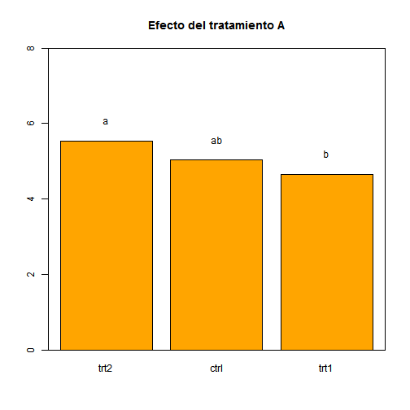
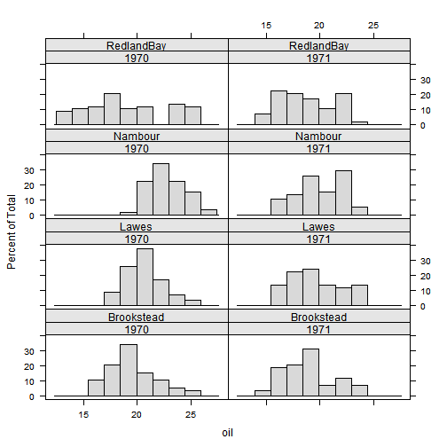
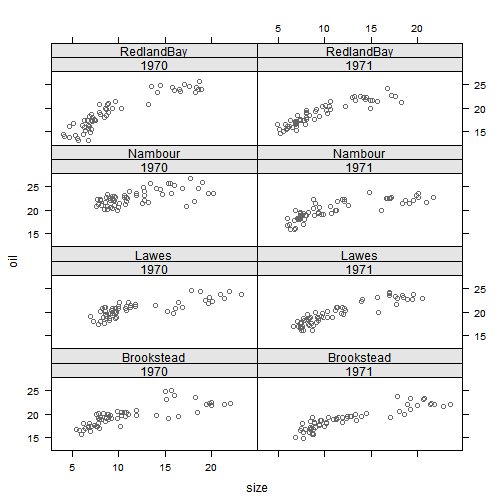
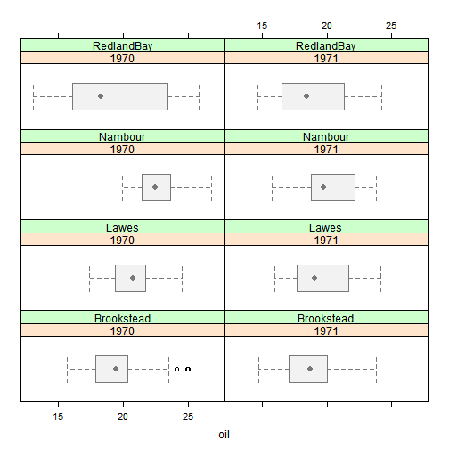
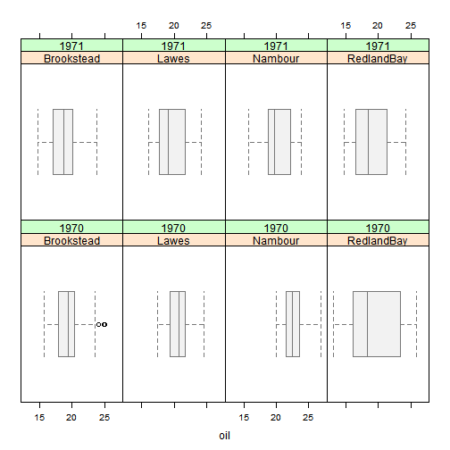
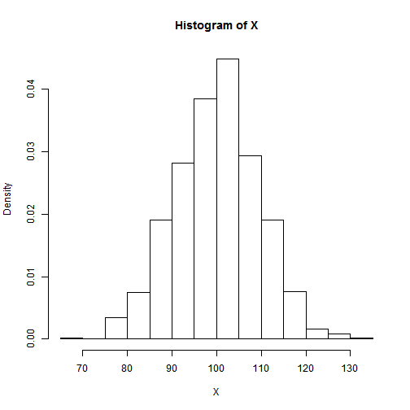
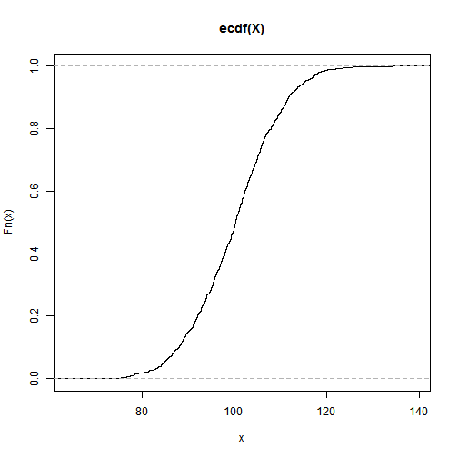

Estadística descriptiva
========================================================

## Medidas de tendencia central

### Media de la pobación 
 

### Media de la muestra
 


```r
DN <- rnorm(100, 10, 5)  #Generar una base de datos de distribución normal, con 100 datos.
DN
```

```
##   [1]  5.8748 11.0778 20.9625 10.9278 12.6350 13.6871 -0.9818 -0.1642
##   [9]  0.4499  6.4021 11.2128  3.6176  7.0554 14.0300 17.9031 11.2698
##  [17] 12.1251  9.3331 17.9411  9.7608 10.3471 -2.1228  7.4617 19.2447
##  [25]  1.6615  1.2671  7.8449  4.2156  5.1962 13.3923  9.5148  4.6380
##  [33] 12.2797  6.4966 13.8033 13.3701 15.6413 13.8126  8.1650  6.7797
##  [41]  9.6254  6.1402 14.2371 10.6784 14.6650  9.0437 -2.8644 10.2247
##  [49] 16.9024  2.8467  6.8628  9.1679 11.2259  9.2483 13.1077 10.8875
##  [57]  7.7130 18.8116 15.5040  9.8963 14.7066 10.3560 13.3601 15.5831
##  [65] 10.6936  2.1221 16.8506  7.4760  4.7573 14.6349 16.7247 11.6623
##  [73]  5.1511  6.7284 16.0723 12.9776  3.7939  1.8613  5.6787 14.0337
##  [81]  9.8234  9.7373 10.6809  0.5848 11.3220 15.9033  6.6463  8.9817
##  [89] 14.5962 11.8275  9.9380  7.4775  2.3274  9.7817 14.0017  8.2354
##  [97]  7.9092  5.8791 11.7536 14.2361
```

```r
hist(DN)
```

 

```r
suma <- sum(DN)
suma
```

```
## [1] 968.9
```

```r
N <- length(DN)
N
```

```
## [1] 100
```

```r
MEDIA <- suma/N
MEDIA
```

```
## [1] 9.689
```

```r
mean(DN)
```

```
## [1] 9.689
```


### Mediana

```r
quantile(DN, 0.5)
```

```
##   50% 
## 9.917
```

```r
median(DN)
```

```
## [1] 9.917
```


### Moda

```r
library(modeest)  # Para calcular la moda en r se requiere del paquete modeest
```

```
## 
## This is package 'modeest' written by P. PONCET.
## For a complete list of functions, use 'library(help = "modeest")' or 'help.start()'.
```

```r
mlv(DN, method = "mfv")
```

```
## Mode (most likely value): 9.689 
## Bickel's modal skewness: 0.1 
## Call: mlv.default(x = DN, method = "mfv")
```


### Función summary

```r
summary(DN)
```

```
##    Min. 1st Qu.  Median    Mean 3rd Qu.    Max. 
##   -2.86    6.61    9.92    9.69   13.50   21.00
```

```r
boxplot(DN)
```

 

---
## Medidas de dispersión

### El rango

```r
min(DN)
```

```
## [1] -2.864
```

```r
max(DN)
```

```
## [1] 20.96
```

```r
R <- (max(DN)) - (min(DN))
R
```

```
## [1] 23.83
```

```r
range(DN)
```

```
## [1] -2.864 20.962
```


### La varianza
#### De la población "FINITA" \[ \sigma^2 = \frac{\sum_{i=1}^{N}(x_i - \mu)^2} {N}\]
#### De la muestra \[ S^2 = \frac{\sum_{i=1}^{n}(x_i - \bar{x})^2} {n-1}\]


```r
DN - mean(DN)
```

```
##   [1]  -3.81438   1.38856  11.27325   1.23857   2.94581   3.99789 -10.67100
##   [8]  -9.85338  -9.23929  -3.28708   1.52355  -6.07160  -2.63378   4.34083
##  [15]   8.21386   1.58061   2.43592  -0.35612   8.25189   0.07162   0.65790
##  [22] -11.81204  -2.22752   9.55551  -8.02770  -8.42208  -1.84426  -5.47356
##  [29]  -4.49297   3.70308  -0.17441  -5.05121   2.59047  -3.19265   4.11414
##  [36]   3.68092   5.95214   4.12341  -1.52417  -2.90955  -0.06383  -3.54898
##  [43]   4.54787   0.98921   4.97580  -0.64555 -12.55366   0.53551   7.21323
##  [50]  -6.84249  -2.82636  -0.52135   1.53666  -0.44093   3.41851   1.19826
##  [57]  -1.97618   9.12243   5.81480   0.20706   5.01743   0.66683   3.67086
##  [64]   5.89390   1.00439  -7.56713   7.16143  -2.21319  -4.93188   4.94565
##  [71]   7.03546   1.97310  -4.53809  -2.96082   6.38305   3.28835  -5.89526
##  [78]  -7.82786  -4.01051   4.34447   0.13419   0.04810   0.99166  -9.10446
##  [85]   1.63276   6.21405  -3.04290  -0.70754   4.90703   2.13831   0.24879
##  [92]  -2.21174  -7.36182   0.09250   4.31253  -1.45385  -1.78003  -3.81014
##  [99]   2.06434   4.54689
```

```r
(DN - mean(DN))^2
```

```
##   [1] 1.455e+01 1.928e+00 1.271e+02 1.534e+00 8.678e+00 1.598e+01 1.139e+02
##   [8] 9.709e+01 8.536e+01 1.080e+01 2.321e+00 3.686e+01 6.937e+00 1.884e+01
##  [15] 6.747e+01 2.498e+00 5.934e+00 1.268e-01 6.809e+01 5.129e-03 4.328e-01
##  [22] 1.395e+02 4.962e+00 9.131e+01 6.444e+01 7.093e+01 3.401e+00 2.996e+01
##  [29] 2.019e+01 1.371e+01 3.042e-02 2.551e+01 6.711e+00 1.019e+01 1.693e+01
##  [36] 1.355e+01 3.543e+01 1.700e+01 2.323e+00 8.465e+00 4.074e-03 1.260e+01
##  [43] 2.068e+01 9.785e-01 2.476e+01 4.167e-01 1.576e+02 2.868e-01 5.203e+01
##  [50] 4.682e+01 7.988e+00 2.718e-01 2.361e+00 1.944e-01 1.169e+01 1.436e+00
##  [57] 3.905e+00 8.322e+01 3.381e+01 4.287e-02 2.517e+01 4.447e-01 1.348e+01
##  [64] 3.474e+01 1.009e+00 5.726e+01 5.129e+01 4.898e+00 2.432e+01 2.446e+01
##  [71] 4.950e+01 3.893e+00 2.059e+01 8.766e+00 4.074e+01 1.081e+01 3.475e+01
##  [78] 6.128e+01 1.608e+01 1.887e+01 1.801e-02 2.313e-03 9.834e-01 8.289e+01
##  [85] 2.666e+00 3.861e+01 9.259e+00 5.006e-01 2.408e+01 4.572e+00 6.189e-02
##  [92] 4.892e+00 5.420e+01 8.556e-03 1.860e+01 2.114e+00 3.168e+00 1.452e+01
##  [99] 4.262e+00 2.067e+01
```

```r
sum((DN - mean(DN))^2)  # Se calcula el numerador
```

```
## [1] 2511
```

```r
length(DN)
```

```
## [1] 100
```

```r
(length(DN) - 1)  # el denominador
```

```
## [1] 99
```

```r

varianza <- sum((DN - mean(DN))^2)/((length(DN)) - 1)  # se puede hacer un vector
varianza
```

```
## [1] 25.36
```

```r
var(DN)  # ó calcular de manera directa mediante la función 'var'
```

```
## [1] 25.36
```


### La desviación estándar
\[ S= \sqrt{S^2 }\]

```r
sqrt(varianza)  # Para el primer ejemplo del cálulo de la varianza
```

```
## [1] 5.036
```

```r
sqrt(var(DN))  # Para el segundo ejemplo
```

```
## [1] 5.036
```

```r
sd(DN)  # De manera directa sobre la base de datos
```

```
## [1] 5.036
```


### El coeficiente de variación
\[ CV=\frac{S}{\bar{x}} (100)\]


```r
sd(DN)/mean(DN) * (100)
```

```
## [1] 51.97
```


### Incluso se puede crear un función para el cálculo

```r
CVAR <- function(x) {
    desviacion <- sd(x)
    media <- mean(x)
    result <- desviacion/media * (100)
    return(result)
}

CVAR(DN)
```

```
## [1] 51.97
```


# Estadística descriptiva con bases de datos

## Cálculo directo de las estadísticas básicas

```r
head(treedata)
```

```
## Error: objeto 'treedata' no encontrado
```

```r
tree <- read.csv("c:/Curso 1/treedata.csv", header = T)
head(tree)
```

```
##         plotID       date plotsize  spcode       species cover   utme
## 1 ATBN-01-0403 08-28-2001     1000 ABIEFRA Abies fraseri     1 275736
## 2 ATBN-01-0532 07-24-2002     1000 ABIEFRA Abies fraseri     8 302847
## 3 ATBN-01-0533 07-24-2002     1000 ABIEFRA Abies fraseri     3 303037
## 4 ATBN-01-0536 07-25-2002     1000 ABIEFRA Abies fraseri     3 273927
## 5 ATBP-01-0001 05/11/1999    10000 ABIEFRA Abies fraseri     8 273857
## 6 ATBP-01-0005 08-25-1999    10000 ABIEFRA Abies fraseri     4 273876
##      utmn elev   tci streamdist disturb     beers
## 1 3942439 1660 5.701      490.9 CORPLOG 0.2244286
## 2 3942772 1712 3.824      454.0  VIRGIN 0.8340878
## 3 3943039 1722 3.894      453.4  LT-SEL 1.3332586
## 4 3935488 1754 3.146      492.5  SETTLE 1.4712484
## 5 3937870 1945 5.682      492.4  VIRGIN 1.6437714
## 6 3935462 1751 5.417      545.9  SETTLE 0.0003287
```

```r
length(tree$cover)
```

```
## [1] 8971
```

```r
sum(tree$cover)
```

```
## [1] 35938
```

```r
mean(tree$cover)
```

```
## [1] 4.006
```

```r
var(tree$cover)
```

```
## [1] 4.43
```

```r
sd(tree$cover)
```

```
## [1] 2.105
```

```r
median(tree$cover)
```

```
## [1] 4
```

```r
min(tree$cover)
```

```
## [1] 1
```

```r
max(tree$cover)
```

```
## [1] 10
```

```r
range(tree$cover)
```

```
## [1]  1 10
```


## Uso de las función "tapply" para bases de datos por grupo

```r
tapply(tree$cover, tree$spcode, sum)  # calcula la suma de la cobertura por especie
```

```
##  ABIEFRA  ACERNEG  ACERNIG  ACERRUB  AILAALT  BETUALL  BETULEN  BETUNIG 
##      478        7        5     4109        9     2163     1564        3 
##  CARYALB  CARYCOR  CARYGLA  CARYOVT  CASTDNT  CATASPE  CLADKEN  DIOSVIR 
##      628      278      890       67      763        4       20       95 
##  FAGUGRA  FRAXAME  FRAXPEN  JUGLCIN  JUGLNIG  JUNIVIR  LIQUSTY  LIRITUL 
##     1695      922       41       18       79       40      198     2159 
##  MAGNACU  MAGNFRA  MAGNTRI  NYSSSYL  PAULTOM  PICERUB  PINUECH  PINUPUN 
##      656     1268       25     1688        4      688       91      343 
##  PINURIG  PINUSTR  PINUVIR  PLATOCC  QUERALB  QUERFLC  QUERIMB  QUERMON 
##      805     1276      727       99     1096      110       14     1876 
##  QUERMUE  QUERRUB  QUERSTE  QUERVEL  ROBIPSE  SALINIG  TILIAME TILIAMEH 
##        9     2452       41      815      957       38      263      721 
##  TSUGCAN  TSUGCAR  ULMUALA  ULMUAME  ULMURUB 
##     3476        5       16       13      131
```

```r
tapply(tree$cover, tree$spcode, mean)
```

```
##  ABIEFRA  ACERNEG  ACERNIG  ACERRUB  AILAALT  BETUALL  BETULEN  BETUNIG 
##    4.686    3.500    5.000    5.169    9.000    4.905    4.149    1.500 
##  CARYALB  CARYCOR  CARYGLA  CARYOVT  CASTDNT  CATASPE  CLADKEN  DIOSVIR 
##    3.451    2.505    3.346    3.722    2.502    1.000    2.857    1.979 
##  FAGUGRA  FRAXAME  FRAXPEN  JUGLCIN  JUGLNIG  JUNIVIR  LIQUSTY  LIRITUL 
##    4.124    2.946    2.562    2.571    3.038    1.818    4.041    4.184 
##  MAGNACU  MAGNFRA  MAGNTRI  NYSSSYL  PAULTOM  PICERUB  PINUECH  PINUPUN 
##    2.916    3.170    2.500    3.802    1.333    4.300    3.500    4.900 
##  PINURIG  PINUSTR  PINUVIR  PLATOCC  QUERALB  QUERFLC  QUERIMB  QUERMON 
##    4.375    3.656    4.251    4.125    4.000    3.793    3.500    5.003 
##  QUERMUE  QUERRUB  QUERSTE  QUERVEL  ROBIPSE  SALINIG  TILIAME TILIAMEH 
##    2.250    4.026    4.100    3.424    3.117    4.222    4.109    4.396 
##  TSUGCAN  TSUGCAR  ULMUALA  ULMUAME  ULMURUB 
##    4.660    2.500    2.286    3.250    3.541
```

```r
tapply(tree$cover, tree$spcode, median)
```

```
##  ABIEFRA  ACERNEG  ACERNIG  ACERRUB  AILAALT  BETUALL  BETULEN  BETUNIG 
##      4.0      3.5      5.0      6.0      9.0      5.0      4.0      1.5 
##  CARYALB  CARYCOR  CARYGLA  CARYOVT  CASTDNT  CATASPE  CLADKEN  DIOSVIR 
##      3.0      2.0      3.0      3.0      2.0      1.0      2.0      2.0 
##  FAGUGRA  FRAXAME  FRAXPEN  JUGLCIN  JUGLNIG  JUNIVIR  LIQUSTY  LIRITUL 
##      4.0      3.0      2.0      2.0      3.0      2.0      3.0      4.0 
##  MAGNACU  MAGNFRA  MAGNTRI  NYSSSYL  PAULTOM  PICERUB  PINUECH  PINUPUN 
##      2.0      3.0      2.5      4.0      1.0      4.0      3.0      4.5 
##  PINURIG  PINUSTR  PINUVIR  PLATOCC  QUERALB  QUERFLC  QUERIMB  QUERMON 
##      4.0      3.0      4.0      4.0      4.0      4.0      2.0      5.0 
##  QUERMUE  QUERRUB  QUERSTE  QUERVEL  ROBIPSE  SALINIG  TILIAME TILIAMEH 
##      2.0      4.0      4.0      3.0      3.0      3.0      4.0      5.0 
##  TSUGCAN  TSUGCAR  ULMUALA  ULMUAME  ULMURUB 
##      4.0      2.5      2.0      2.5      3.0
```

```r
tapply(tree$cover, tree$spcode, var)
```

```
##  ABIEFRA  ACERNEG  ACERNIG  ACERRUB  AILAALT  BETUALL  BETULEN  BETUNIG 
##   4.7125   0.5000       NA   4.1680       NA   3.6227   4.3130   0.5000 
##  CARYALB  CARYCOR  CARYGLA  CARYOVT  CASTDNT  CATASPE  CLADKEN  DIOSVIR 
##   3.0445   2.4886   2.9139   2.3301   1.6192   0.0000   3.1429   0.9145 
##  FAGUGRA  FRAXAME  FRAXPEN  JUGLCIN  JUGLNIG  JUNIVIR  LIQUSTY  LIRITUL 
##   4.8651   2.7951   1.4625   0.9524   2.3585   0.3463   6.4566   5.1486 
##  MAGNACU  MAGNFRA  MAGNTRI  NYSSSYL  PAULTOM  PICERUB  PINUECH  PINUPUN 
##   2.6044   3.1339   1.1667   2.9855   0.3333   4.2994   1.2200   3.5696 
##  PINURIG  PINUSTR  PINUVIR  PLATOCC  QUERALB  QUERFLC  QUERIMB  QUERMON 
##   3.5581   3.5309   3.9893   2.7228   5.1209   5.0271  14.3333   4.4946 
##  QUERMUE  QUERRUB  QUERSTE  QUERVEL  ROBIPSE  SALINIG  TILIAME TILIAMEH 
##   0.2500   5.4598   1.6556   3.2748   2.7444   8.4444   4.7974   3.6886 
##  TSUGCAN  TSUGCAR  ULMUALA  ULMUAME  ULMURUB 
##   4.4718   0.5000   0.2381   3.5833   1.5330
```

```r
tapply(tree$cover, tree$spcode, sd)
```

```
##  ABIEFRA  ACERNEG  ACERNIG  ACERRUB  AILAALT  BETUALL  BETULEN  BETUNIG 
##   2.1708   0.7071       NA   2.0416       NA   1.9033   2.0768   0.7071 
##  CARYALB  CARYCOR  CARYGLA  CARYOVT  CASTDNT  CATASPE  CLADKEN  DIOSVIR 
##   1.7449   1.5775   1.7070   1.5265   1.2725   0.0000   1.7728   0.9563 
##  FAGUGRA  FRAXAME  FRAXPEN  JUGLCIN  JUGLNIG  JUNIVIR  LIQUSTY  LIRITUL 
##   2.2057   1.6719   1.2093   0.9759   1.5357   0.5885   2.5410   2.2690 
##  MAGNACU  MAGNFRA  MAGNTRI  NYSSSYL  PAULTOM  PICERUB  PINUECH  PINUPUN 
##   1.6138   1.7703   1.0801   1.7278   0.5774   2.0735   1.1045   1.8893 
##  PINURIG  PINUSTR  PINUVIR  PLATOCC  QUERALB  QUERFLC  QUERIMB  QUERMON 
##   1.8863   1.8791   1.9973   1.6501   2.2629   2.2421   3.7859   2.1201 
##  QUERMUE  QUERRUB  QUERSTE  QUERVEL  ROBIPSE  SALINIG  TILIAME TILIAMEH 
##   0.5000   2.3366   1.2867   1.8097   1.6566   2.9059   2.1903   1.9206 
##  TSUGCAN  TSUGCAR  ULMUALA  ULMUAME  ULMURUB 
##   2.1147   0.7071   0.4880   1.8930   1.2382
```

```r
tapply(tree$cover, tree$spcode, min)
```

```
##  ABIEFRA  ACERNEG  ACERNIG  ACERRUB  AILAALT  BETUALL  BETULEN  BETUNIG 
##        1        3        5        1        9        1        1        1 
##  CARYALB  CARYCOR  CARYGLA  CARYOVT  CASTDNT  CATASPE  CLADKEN  DIOSVIR 
##        1        1        1        1        1        1        1        1 
##  FAGUGRA  FRAXAME  FRAXPEN  JUGLCIN  JUGLNIG  JUNIVIR  LIQUSTY  LIRITUL 
##        1        1        1        2        1        1        1        1 
##  MAGNACU  MAGNFRA  MAGNTRI  NYSSSYL  PAULTOM  PICERUB  PINUECH  PINUPUN 
##        1        1        1        1        1        1        1        1 
##  PINURIG  PINUSTR  PINUVIR  PLATOCC  QUERALB  QUERFLC  QUERIMB  QUERMON 
##        1        1        1        2        1        1        1        1 
##  QUERMUE  QUERRUB  QUERSTE  QUERVEL  ROBIPSE  SALINIG  TILIAME TILIAMEH 
##        2        1        3        1        1        2        1        1 
##  TSUGCAN  TSUGCAR  ULMUALA  ULMUAME  ULMURUB 
##        1        2        2        2        1
```

```r
tapply(tree$cover, tree$spcode, max)
```

```
##  ABIEFRA  ACERNEG  ACERNIG  ACERRUB  AILAALT  BETUALL  BETULEN  BETUNIG 
##        9        4        5       10        9        9        9        2 
##  CARYALB  CARYCOR  CARYGLA  CARYOVT  CASTDNT  CATASPE  CLADKEN  DIOSVIR 
##        9        7        9        6        7        1        5        6 
##  FAGUGRA  FRAXAME  FRAXPEN  JUGLCIN  JUGLNIG  JUNIVIR  LIQUSTY  LIRITUL 
##       10        9        6        4        8        3        9       10 
##  MAGNACU  MAGNFRA  MAGNTRI  NYSSSYL  PAULTOM  PICERUB  PINUECH  PINUPUN 
##        9        9        4        9        2        9        6        9 
##  PINURIG  PINUSTR  PINUVIR  PLATOCC  QUERALB  QUERFLC  QUERIMB  QUERMON 
##       10        9        9        8        9        8        9        9 
##  QUERMUE  QUERRUB  QUERSTE  QUERVEL  ROBIPSE  SALINIG  TILIAME TILIAMEH 
##        3        9        7        9        9        9       10        9 
##  TSUGCAN  TSUGCAR  ULMUALA  ULMUAME  ULMURUB 
##       10        3        3        6        7
```

```r
tapply(tree$cover, tree$spcode, quantile, c(0.25))
```

```
##  ABIEFRA  ACERNEG  ACERNIG  ACERRUB  AILAALT  BETUALL  BETULEN  BETUNIG 
##     3.00     3.25     5.00     4.00     9.00     4.00     2.00     1.25 
##  CARYALB  CARYCOR  CARYGLA  CARYOVT  CASTDNT  CATASPE  CLADKEN  DIOSVIR 
##     2.00     1.00     2.00     3.00     2.00     1.00     1.50     1.00 
##  FAGUGRA  FRAXAME  FRAXPEN  JUGLCIN  JUGLNIG  JUNIVIR  LIQUSTY  LIRITUL 
##     2.00     2.00     2.00     2.00     2.00     1.25     2.00     2.00 
##  MAGNACU  MAGNFRA  MAGNTRI  NYSSSYL  PAULTOM  PICERUB  PINUECH  PINUPUN 
##     2.00     2.00     2.00     3.00     1.00     3.00     3.00     4.00 
##  PINURIG  PINUSTR  PINUVIR  PLATOCC  QUERALB  QUERFLC  QUERIMB  QUERMON 
##     3.00     2.00     3.00     3.00     2.00     2.00     1.00     4.00 
##  QUERMUE  QUERRUB  QUERSTE  QUERVEL  ROBIPSE  SALINIG  TILIAME TILIAMEH 
##     2.00     2.00     3.00     2.00     2.00     2.00     2.00     3.00 
##  TSUGCAN  TSUGCAR  ULMUALA  ULMUAME  ULMURUB 
##     3.00     2.25     2.00     2.00     3.00
```

```r
tapply(tree$cover, tree$spcode, quantile, c(0.5))
```

```
##  ABIEFRA  ACERNEG  ACERNIG  ACERRUB  AILAALT  BETUALL  BETULEN  BETUNIG 
##      4.0      3.5      5.0      6.0      9.0      5.0      4.0      1.5 
##  CARYALB  CARYCOR  CARYGLA  CARYOVT  CASTDNT  CATASPE  CLADKEN  DIOSVIR 
##      3.0      2.0      3.0      3.0      2.0      1.0      2.0      2.0 
##  FAGUGRA  FRAXAME  FRAXPEN  JUGLCIN  JUGLNIG  JUNIVIR  LIQUSTY  LIRITUL 
##      4.0      3.0      2.0      2.0      3.0      2.0      3.0      4.0 
##  MAGNACU  MAGNFRA  MAGNTRI  NYSSSYL  PAULTOM  PICERUB  PINUECH  PINUPUN 
##      2.0      3.0      2.5      4.0      1.0      4.0      3.0      4.5 
##  PINURIG  PINUSTR  PINUVIR  PLATOCC  QUERALB  QUERFLC  QUERIMB  QUERMON 
##      4.0      3.0      4.0      4.0      4.0      4.0      2.0      5.0 
##  QUERMUE  QUERRUB  QUERSTE  QUERVEL  ROBIPSE  SALINIG  TILIAME TILIAMEH 
##      2.0      4.0      4.0      3.0      3.0      3.0      4.0      5.0 
##  TSUGCAN  TSUGCAR  ULMUALA  ULMUAME  ULMURUB 
##      4.0      2.5      2.0      2.5      3.0
```

```r
tapply(tree$cover, tree$spcode, quantile, c(0.75))
```

```
##  ABIEFRA  ACERNEG  ACERNIG  ACERRUB  AILAALT  BETUALL  BETULEN  BETUNIG 
##     6.75     3.75     5.00     7.00     9.00     6.00     5.00     1.75 
##  CARYALB  CARYCOR  CARYGLA  CARYOVT  CASTDNT  CATASPE  CLADKEN  DIOSVIR 
##     5.00     3.00     5.00     4.75     3.00     1.00     4.50     2.00 
##  FAGUGRA  FRAXAME  FRAXPEN  JUGLCIN  JUGLNIG  JUNIVIR  LIQUSTY  LIRITUL 
##     6.00     4.00     3.00     3.00     3.75     2.00     5.00     6.00 
##  MAGNACU  MAGNFRA  MAGNTRI  NYSSSYL  PAULTOM  PICERUB  PINUECH  PINUPUN 
##     4.00     4.00     3.00     5.00     1.50     6.00     4.00     6.00 
##  PINURIG  PINUSTR  PINUVIR  PLATOCC  QUERALB  QUERFLC  QUERIMB  QUERMON 
##     6.00     5.00     6.00     5.00     6.00     6.00     4.50     7.00 
##  QUERMUE  QUERRUB  QUERSTE  QUERVEL  ROBIPSE  SALINIG  TILIAME TILIAMEH 
##     2.25     6.00     4.75     5.00     4.00     5.00     6.00     6.00 
##  TSUGCAN  TSUGCAR  ULMUALA  ULMUAME  ULMURUB 
##     7.00     2.75     2.50     3.75     4.00
```

```r
cbind(s, med)  # cbind sirve para combinar en un dataframe las variales generadas
```

```
## Error: objeto 's' no encontrado
```


## Uso del paquete "doBy" para bases de datos

```r
library(doBy)
```

```
## Loading required package: survival
## Loading required package: splines
## Loading required package: MASS
```

```r
CARB <- read.csv("C:/Curso 1/Captura.csv", header = T)
head(CARB)
```

```
##   Planta Origen Tratamiento Conc Captura
## 1    Qn1 Quebec    Sin cong   95    16.0
## 2    Qn1 Quebec    Sin cong  175    30.4
## 3    Qn1 Quebec    Sin cong  250    34.8
## 4    Qn1 Quebec    Sin cong  350    37.2
## 5    Qn1 Quebec    Sin cong  500    35.3
## 6    Qn1 Quebec    Sin cong  675    39.2
```

```r
COFUN <- function(x) {
    c(m = mean(x), sd = sd(x), cv = CVAR(x))
}
PT <- summaryBy(Captura ~ Planta + Tratamiento, data = CARB, FUN = COFUN)
PT
```

```
##    Planta Tratamiento Captura.m Captura.sd Captura.cv
## 1     Mc1        cong     18.00      4.119      22.88
## 2     Mc2        cong     12.14      2.187      18.01
## 3     Mc3        cong     17.30      3.049      17.62
## 4     Mn1    Sin cong     26.40      8.694      32.93
## 5     Mn2    Sin cong     27.34      7.653      27.99
## 6     Mn3    Sin cong     24.11      6.485      26.89
## 7     Qc1        cong     29.97      8.335      27.81
## 8     Qc2        cong     32.70     11.337      34.67
## 9     Qc3        cong     32.59     10.321      31.67
## 10    Qn1    Sin cong     33.23      8.215      24.72
## 11    Qn2    Sin cong     35.16     11.004      31.30
## 12    Qn3    Sin cong     37.61     10.350      27.52
```

```r
# write.csv(PT,'c:/Curso 1/PT.csv')
```


```r
library(agridat)
```

```
## Loading required package: grid
## Loading required package: lattice
## Loading required package: reshape2
```

```r
prueba <- (australia.soybean)
head(prueba)
```

```
##   env   loc year gen yield height lodging  size protein   oil
## 1 L70 Lawes 1970 G01 2.387  1.445    4.25  8.45   36.70 20.89
## 2 L70 Lawes 1970 G02 2.282  1.450    4.25  9.95   37.55 20.74
## 3 L70 Lawes 1970 G03 2.567  1.460    3.75 10.85   37.80 21.30
## 4 L70 Lawes 1970 G04 2.877  1.260    3.50 10.05   38.45 21.99
## 5 L70 Lawes 1970 G05 2.392  1.335    3.50 11.00   37.50 22.13
## 6 L70 Lawes 1970 G06 2.408  1.360    4.00 11.75   38.25 21.16
```

```r
# write.csv(prueba,'c:/Curso 1/Soya.csv')

library(doBy)
FUNCION <- function(x) {
    c(n = length(x), m = mean(x), mm = median(x), s2 = var(x), ss = sd(x), cv = CVAR(x))
}

summaryBy(oil ~ year + env + loc, data = prueba, FUN = FUNCION)
```

```
##   year env        loc oil.n oil.m oil.mm oil.s2 oil.ss oil.cv
## 1 1970 B70 Brookstead    58 19.55  19.41  4.677  2.163 11.065
## 2 1970 L70      Lawes    58 20.67  20.74  2.995  1.731  8.371
## 3 1970 N70    Nambour    58 22.72  22.45  2.718  1.648  7.257
## 4 1970 R70 RedlandBay    58 19.03  18.27 14.155  3.762 19.767
## 5 1971 B71 Brookstead    58 18.90  18.73  5.106  2.260 11.956
## 6 1971 L71      Lawes    58 19.67  19.03  5.854  2.420 12.301
## 7 1971 N71    Nambour    58 20.04  19.74  4.382  2.093 10.445
## 8 1971 R71 RedlandBay    58 18.76  18.47  6.211  2.492 13.288
```


Uso de la librería LATTICE para gráficos apilados

```r
Año <- factor(prueba$year, levels = c(1970, 1971))
histogram(~oil | Año + loc, data = prueba, col = "gray85", strip = strip.custom(bg = "gray90"))
```

 

```r

xyplot(oil ~ size | Año + loc, data = prueba, col = "gray40", strip = strip.custom(bg = "gray90"))
```

 

```r

bwplot(~oil | Año + loc, data = prueba, par.settings = list(box.umbrella = list(col = "gray47"), 
    box.dot = list(col = "gray47"), box.rectangle = list(fill = rep(c("gray95")), 
        col = "gray47"), plot.symbol = list(pch = 1, col = "black")))
```

 

```r

bwplot(~oil | loc + Año, data = prueba, layout = c(4, 2), pch = "|", as.table = F, 
    par.settings = list(box.umbrella = list(col = "gray47"), box.dot = list(col = "gray47"), 
        box.rectangle = list(fill = rep(c("gray95")), col = "gray47"), plot.symbol = list(pch = 1, 
            col = "black")))
```

 


# Probabilidad y teoría de distribuciones 

## Distribución normal y función acumulativa

```r
library(stats)
X <- rnorm(1000, 100, 10)  # Genera una distribución normal
hist(X, freq = F)  # Histograma de la distribución normal
```

 

```r
P <- ecdf(X)  # Uso de la función de la distribución acumulativa
P
```

```
## Empirical CDF 
## Call: ecdf(X)
##  x[1:1000] =  69,  75,  75,  ..., 1.3e+02, 1.3e+02
```

```r
summary(P)
```

```
## Empirical CDF:	  1000 unique values with summary
##    Min. 1st Qu.  Median    Mean 3rd Qu.    Max. 
##    69.1    93.8   100.0   100.0   106.0   134.0
```

```r
K <- knots(P)  # Datos de la distribución
KK <- as.data.frame(K)  # Datos de la distribución arreglados en un dataframe
head(KK)  # Muestra los encabezados
```

```
##       K
## 1 69.12
## 2 75.08
## 3 75.50
## 4 76.52
## 5 76.52
## 6 76.64
```

```r
plot(P)  # Grafíca la función acumulada
```

 

```r
P(80)  # es la probabilidad de obtener un valor de 80 gramos o menos 
```

```
## [1] 0.018
```

```r
1 - P(110)  # Probabilidad de 110 gramos o más
```

```
## [1] 0.146
```

```r
P(120) - P(80)  # Probabilidad de entre 80 y 120 gramos 
```

```
## [1] 0.969
```

```r
P(110) - P(90)  # Probabilidad de entre 90 y 110 gramos 
```

```
## [1] 0.704
```


## Distribución de medias
### Población de cerdos 
#### media= 47 cm
#### desviación= 12 cm
### Probabilidad de muestra de 9 con media mayor a 50?


```r
# Cálculo del error estándar de la media muestral
ES <- 12/sqrt(9)
pnorm(q = 50, mean = 47, sd = ES, lower.tail = F)
```

```
## [1] 0.2266
```


# Intervalos de confianza distribución normal
## Coeficiente de confianza = 95%

```r
media <- 84.3
s <- 12
n <- 15
s/sqrt(n)
```

```
## [1] 3.098
```

```r
qnorm(0.975)
```

```
## [1] 1.96
```

```r
error <- qnorm(0.975) * s/sqrt(n)
error
```

```
## [1] 6.073
```

```r
izquierda <- media - error
derecha <- media + error
izquierda
```

```
## [1] 78.23
```

```r
derecha
```

```
## [1] 90.37
```


# Intervalos de confianza distribución t de student
## Coeficiente de confianza = 95%

```r
media <- 11.53
s <- 3.681
n <- 15
s/sqrt(n)
```

```
## [1] 0.9504
```

```r
qt(0.975, df = n - 1)
```

```
## [1] 2.145
```

```r
error <- qt(0.975, df = n - 1) * s/sqrt(n)
error
```

```
## [1] 2.038
```

```r
izquierda <- media - error
derecha <- media + error
izquierda
```

```
## [1] 9.492
```

```r
derecha
```

```
## [1] 13.57
```

## Librería doBy y el cálculo de los intervalos de confianza en la distribución normal Z

```r
prueba<-read.csv("c:/Curso 1/Soya.csv", header=T)
head(prueba)
```

```
##   env   loc year gen yield height lodging  size protein   oil
## 1 L70 Lawes 1970 G01 2.387  1.445    4.25  8.45   36.70 20.89
## 2 L70 Lawes 1970 G02 2.282  1.450    4.25  9.95   37.55 20.74
## 3 L70 Lawes 1970 G03 2.567  1.460    3.75 10.85   37.80 21.30
## 4 L70 Lawes 1970 G04 2.877  1.260    3.50 10.05   38.45 21.99
## 5 L70 Lawes 1970 G05 2.392  1.335    3.50 11.00   37.50 22.13
## 6 L70 Lawes 1970 G06 2.408  1.360    4.00 11.75   38.25 21.16
```

```r

library(doBy)
FUNCION<-function(x){c(n=length(x),
                       m=mean(x),mm=median(x),
                       s2=var(x),ss=sd(x), 
                       cv=CVAR(x),# ED
            error=sd(x)/sqrt(length(x)),#Cálculo del error estándar 
            ICSUP=mean(x)+(1.96*(sd(x)/sqrt(length(x)))), #Límite superior
            ICINF=mean(x)-(1.96*(sd(x)/sqrt(length(x)))))}#Límite inferior
summaryBy(oil~year+env+loc,data=prueba, FUN=FUNCION)
```

```
##   year env        loc oil.n oil.m oil.mm oil.s2 oil.ss oil.cv oil.error
## 1 1970 B70 Brookstead    58 19.55  19.41  4.677  2.163 11.065    0.2840
## 2 1970 L70      Lawes    58 20.67  20.74  2.995  1.731  8.371    0.2272
## 3 1970 N70    Nambour    58 22.72  22.45  2.718  1.648  7.257    0.2165
## 4 1970 R70 RedlandBay    58 19.03  18.27 14.155  3.762 19.767    0.4940
## 5 1971 B71 Brookstead    58 18.90  18.73  5.106  2.260 11.956    0.2967
## 6 1971 L71      Lawes    58 19.67  19.03  5.854  2.420 12.301    0.3177
## 7 1971 N71    Nambour    58 20.04  19.74  4.382  2.093 10.445    0.2749
## 8 1971 R71 RedlandBay    58 18.76  18.47  6.211  2.492 13.288    0.3272
##   oil.ICSUP oil.ICINF
## 1     20.10     18.99
## 2     21.12     20.23
## 3     23.14     22.29
## 4     20.00     18.06
## 5     19.48     18.32
## 6     20.29     19.05
## 7     20.58     19.50
## 8     19.40     18.11
```

```r
# write.csv
```


