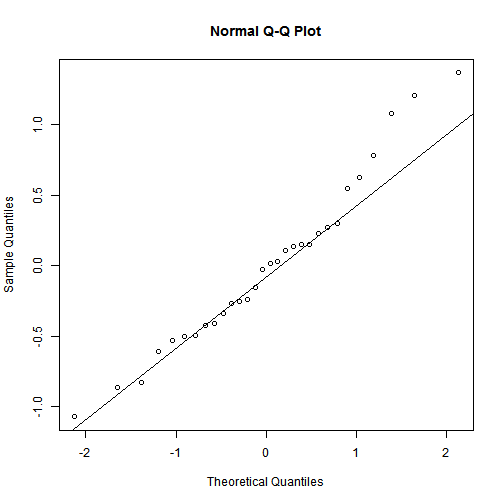
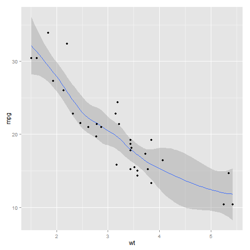
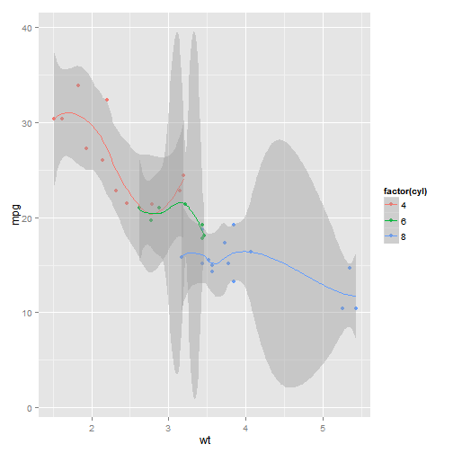

ANOVA
========================================================

## Anova unifactorial paso a paso

```r
# Datos de Montgomery 2004
MON <- read.csv("c:/Curso 1/MON.csv", header = T)  # Se llama a la base de datos y se le nombra MON
head(MON)  # Leer los primeras seis filas de la base
```

```
##   X15 X20 X25 X30 X35
## 1   7  12  14  19   7
## 2   7  17  18  25  10
## 3  15  12  18  22  11
## 4  11  18  19  19  15
## 5   9  18  19  23  11
```

```r
boxplot(MON)
```

 

```r
stripchart(MON, vertical = T)
```

 

```r

attach(MON)  # Fijar la base de datos para trabajar de manera directa
SSTO <- sum(MON^2) - (sum(MON)^2/(25))  # Se calcula la suma de los cuadrados totales
SSTO  #resultado
```

```
## [1] 637
```

```r
SSS <- ((1/5) * ((sum(X15)^2) + (sum(X20)^2) + (sum(X25)^2) + (sum(X30)^2) + 
    (sum(X35)^2))) - ((sum(MON)^2)/(25))  # Se calcula la suma de los cuadrados entre tratamientos.
SSS  #resultado
```

```
## [1] 475.8
```

```r
SSE <- SSTO - SSS  # Suma del cuadrado del error
SSE  #resultado
```

```
## [1] 161.2
```

```r
MSSS <- SSS/4  # Cuadrado medio
MSSS  #resultado
```

```
## [1] 118.9
```

```r
MSSE <- SSE/20  # Cuadrado medio del error
MSSE  #resultado
```

```
## [1] 8.06
```

```r
F0 <- MSSS/MSSE  # finalmente se calcula el valor de F0
F0  #resultado
```

```
## [1] 14.76
```

```r
detach(MON)
```


## ANOVA se puede calcular de varias formas en R pero las principales son con los comandos ANOVA y aov

```r
# Y de manera directa con la función anova de R
STMON <- stack(MON)  # se utiliza el comando stack para reordenar la base de datos
head(STMON)
```

```
##   values ind
## 1      7 X15
## 2      7 X15
## 3     15 X15
## 4     11 X15
## 5      9 X15
## 6     12 X20
```

```r
anova(lm(values ~ factor(ind), data = STMON))  # Se llama la función anova donde: lm = modelo lineal; values= valores de ; ind = factor por el cual se clasifican [X15,X20...] y con data = STMON se llama a la base de datos creada anteriormente.
```

```
## Analysis of Variance Table
## 
## Response: values
##             Df Sum Sq Mean Sq F value  Pr(>F)    
## factor(ind)  4    476   118.9    14.8 9.1e-06 ***
## Residuals   20    161     8.1                    
## ---
## Signif. codes:  0 '***' 0.001 '**' 0.01 '*' 0.05 '.' 0.1 ' ' 1
```

```r
fit <- aov(values ~ factor(ind), data = STMON)  # Peso= Variable respuesta 
summary(fit)
```

```
##             Df Sum Sq Mean Sq F value  Pr(>F)    
## factor(ind)  4    476   118.9    14.8 9.1e-06 ***
## Residuals   20    161     8.1                    
## ---
## Signif. codes:  0 '***' 0.001 '**' 0.01 '*' 0.05 '.' 0.1 ' ' 1
```

```r
TukeyHSD(fit, conf.level = 0.95)
```

```
##   Tukey multiple comparisons of means
##     95% family-wise confidence level
## 
## Fit: aov(formula = values ~ factor(ind), data = STMON)
## 
## $`factor(ind)`
##          diff     lwr    upr  p adj
## X20-X15   5.6   0.227 10.973 0.0385
## X25-X15   7.8   2.427 13.173 0.0026
## X30-X15  11.8   6.427 17.173 0.0000
## X35-X15   1.0  -4.373  6.373 0.9798
## X25-X20   2.2  -3.173  7.573 0.7372
## X30-X20   6.2   0.827 11.573 0.0189
## X35-X20  -4.6  -9.973  0.773 0.1163
## X30-X25   4.0  -1.373  9.373 0.2101
## X35-X25  -6.8 -12.173 -1.427 0.0091
## X35-X30 -10.8 -16.173 -5.427 0.0001
```

```r
plot(TukeyHSD(fit))
```

 


## Otro ejemplo con el aov más gráficos

```r
Plantas <- read.csv("c:/Curso 1/Plantas.csv", header = T)  #Llamamos la base Plantas
attach(Plantas)
# Antes de realizar el ANOVA tenemos que hacer pruebas de normalidad Para
# esto utilizamos el Shapiro Wilks test
A <- Plantas[Grupo == "ctrl", ]  #Extrae una parte de la base de datos'Ctrl'
shapiro.test(A$Peso)
```

```
## 
## 	Shapiro-Wilk normality test
## 
## data:  A$Peso
## W = 0.9567, p-value = 0.7475
```

```r
hist(A$Peso)
```

 

```r
B <- Plantas[Grupo == "trt1", ]  #Extrae una parte de la base de datos'trt1'
shapiro.test(B$Peso)
```

```
## 
## 	Shapiro-Wilk normality test
## 
## data:  B$Peso
## W = 0.9304, p-value = 0.4519
```

```r
hist(B$Peso)
```

 

```r
C <- Plantas[Grupo == "trt2", ]  #Extrae una parte de la base de datos'trt2'
shapiro.test(C$Peso)
```

```
## 
## 	Shapiro-Wilk normality test
## 
## data:  C$Peso
## W = 0.941, p-value = 0.5643
```

```r
hist(C$Peso)
```

 

```r

plot(Peso ~ Grupo)  ##boxplot
```

 

```r
tapply(Peso, Grupo, mean)  # Muestra la media de los tres grupos
```

```
##  ctrl  trt1  trt2 
## 5.032 4.661 5.526
```

```r
tapply(Peso, Grupo, var)  # Muestra la varianza de los tres grupos
```

```
##   ctrl   trt1   trt2 
## 0.3400 0.6299 0.1959
```

```r
fligner.test(Peso ~ Grupo)
```

```
## 
## 	Fligner-Killeen test of homogeneity of variances
## 
## data:  Peso by Grupo
## Fligner-Killeen:med chi-squared = 2.35, df = 2, p-value = 0.3088
```

```r

# Una vez cumplidos los supuestos básicos se procede a correr el ANOVA
A <- factor(Grupo)
head(Plantas)  #se tienen tres niveles para Grupo
```

```
##   Peso Grupo
## 1 4.17  ctrl
## 2 5.58  ctrl
## 3 5.18  ctrl
## 4 6.11  ctrl
## 5 4.50  ctrl
## 6 4.61  ctrl
```

```r
fit <- aov(Peso ~ A)  # Peso= Variable respuesta 
summary(fit)
```

```
##             Df Sum Sq Mean Sq F value Pr(>F)  
## A            2   3.77   1.883    4.85  0.016 *
## Residuals   27  10.49   0.389                 
## ---
## Signif. codes:  0 '***' 0.001 '**' 0.01 '*' 0.05 '.' 0.1 ' ' 1
```

```r

# Pruebas de RESIDUALES
RES <- residuals(fit)  #Calcula los residuales del modelo
plot(RES)  # Muestra la distribución de los residuales en el gráfico
```

 

```r
qqnorm(RES)
qqline(RES)
```

 


## Uso de la librería agricolae para la prueba de Tukey para ver diferencias entre las medias

```r
library(agricolae)
out <- HSD.test(y = fit, trt = "A", group = T, console = TRUE)
```

```
## 
## Study: fit ~ "A"
## 
## HSD Test for Peso 
## 
## Mean Square Error:  0.3886 
## 
## A,  means
## 
##       Peso    std  r  Min  Max
## ctrl 5.032 0.5831 10 4.17 6.11
## trt1 4.661 0.7937 10 3.59 6.03
## trt2 5.526 0.4426 10 4.92 6.31
## 
## alpha: 0.05 ; Df Error: 27 
## Critical Value of Studentized Range: 3.506 
## 
## Honestly Significant Difference: 0.6912 
## 
## Means with the same letter are not significantly different.
## 
## Groups, Treatments and means
## a 	 trt2 	 5.526 
## ab 	 ctrl 	 5.032 
## b 	 trt1 	 4.661
```

```r
## Crear un gráfico
bar.group(out$groups, main = "Efecto del tratamiento A", border = "black", col = "orange", 
    ylim = c(0, 8))
box()
```

 


## Modelo multifactorial

```r
peso <- read.csv(file = "c:/Curso 1/Crecimiento.csv", header = TRUE)
attach(peso)
str(peso)
```

```
## 'data.frame':	48 obs. of  3 variables:
##  $ supplement: Factor w/ 4 levels "agrimore","control",..: 3 3 3 3 2 2 2 2 4 4 ...
##  $ diet      : Factor w/ 3 levels "barley","oats",..: 3 3 3 3 3 3 3 3 3 3 ...
##  $ gain      : num  17.4 16.8 18.1 15.8 17.7 ...
```

```r

barplot(tapply(gain, list(diet, supplement), mean), beside = T, ylim = c(0, 
    35), col = c("grey21", "grey51", "grey84"))
labs <- c("Barley", "Oats", "Wheat")
legend(3, 35, labs, fill = c("grey21", "grey51", "grey84"))
box()
```

 

```r

tapply(gain, list(diet, supplement), mean)
```

```
##        agrimore control supergain supersupp
## barley    26.35   23.30     22.47     25.58
## oats      23.30   20.49     19.66     21.86
## wheat     19.64   17.41     17.01     19.67
```

```r

model <- aov(gain ~ diet * supplement)  ##Máximo
# model<-aov(gain~diet+supplement+diet:supplement)
summary(model)
```

```
##                 Df Sum Sq Mean Sq F value Pr(>F)    
## diet             2  287.2   143.6   83.52  3e-14 ***
## supplement       3   91.9    30.6   17.81  3e-07 ***
## diet:supplement  6    3.4     0.6    0.33   0.92    
## Residuals       36   61.9     1.7                   
## ---
## Signif. codes:  0 '***' 0.001 '**' 0.01 '*' 0.05 '.' 0.1 ' ' 1
```

```r
interaction.plot(response = gain, x.factor = supplement, trace.factor = diet)
```

 

```r

# Ahora se puede simplificar el modelo, dejando fuera la parte de la
# interacción
model2 <- aov(gain ~ diet + supplement)
summary(model2)
```

```
##             Df Sum Sq Mean Sq F value  Pr(>F)    
## diet         2  287.2   143.6    92.4 4.2e-16 ***
## supplement   3   91.9    30.6    19.7 4.0e-08 ***
## Residuals   42   65.3     1.6                    
## ---
## Signif. codes:  0 '***' 0.001 '**' 0.01 '*' 0.05 '.' 0.1 ' ' 1
```

```r

# La desventaja del ANOVA es que no muestra el efecto de los tamaños y no
# permite trabajar con muchos niveles de los dos factores significativos
# summary.lm es más informativo que summary.aov

summary.lm(model2)
```

```
## 
## Call:
## aov(formula = gain ~ diet + supplement)
## 
## Residuals:
##     Min      1Q  Median      3Q     Max 
## -2.3079 -0.8593 -0.0771  0.9205  2.9061 
## 
## Coefficients:
##                     Estimate Std. Error t value Pr(>|t|)    
## (Intercept)           26.123      0.441   59.26  < 2e-16 ***
## dietoats              -3.093      0.441   -7.02  1.4e-08 ***
## dietwheat             -5.990      0.441  -13.59  < 2e-16 ***
## supplementcontrol     -2.697      0.509   -5.30  4.0e-06 ***
## supplementsupergain   -3.381      0.509   -6.64  4.7e-08 ***
## supplementsupersupp   -0.727      0.509   -1.43     0.16    
## ---
## Signif. codes:  0 '***' 0.001 '**' 0.01 '*' 0.05 '.' 0.1 ' ' 1
## 
## Residual standard error: 1.25 on 42 degrees of freedom
## Multiple R-squared:  0.853,	Adjusted R-squared:  0.836 
## F-statistic: 48.8 on 5 and 42 DF,  p-value: <2e-16
```

```r

## Post-doc comparación mútiple
model.tables(model2, type = "means")
```

```
## Tables of means
## Grand mean
##       
## 21.39 
## 
##  diet 
## diet
## barley   oats  wheat 
##  24.42  21.33  18.43 
## 
##  supplement 
## supplement
##  agrimore   control supergain supersupp 
##     23.09     20.40     19.71     22.37
```

```r
multicomp <- TukeyHSD(model2)
multicomp
```

```
##   Tukey multiple comparisons of means
##     95% family-wise confidence level
## 
## Fit: aov(formula = gain ~ diet + supplement)
## 
## $diet
##                diff    lwr    upr p adj
## oats-barley  -3.093 -4.164 -2.022     0
## wheat-barley -5.990 -7.061 -4.919     0
## wheat-oats   -2.897 -3.968 -1.826     0
## 
## $supplement
##                        diff     lwr     upr  p adj
## control-agrimore    -2.6967 -4.0583 -1.3351 0.0000
## supergain-agrimore  -3.3815 -4.7431 -2.0198 0.0000
## supersupp-agrimore  -0.7274 -2.0890  0.6343 0.4889
## supergain-control   -0.6848 -2.0464  0.6769 0.5400
## supersupp-control    1.9693  0.6077  3.3310 0.0020
## supersupp-supergain  2.6541  1.2925  4.0157 0.0000
```

```r
plot(multicomp)
```

  

```r

## Crear un gráfico para el efecto del suplemento
out <- HSD.test(y = model2, trt = "supplement", group = T, console = TRUE)
```

```
## 
## Study: model2 ~ "supplement"
## 
## HSD Test for gain 
## 
## Mean Square Error:  1.555 
## 
## supplement,  means
## 
##            gain   std  r   Min   Max
## agrimore  23.10 3.176 12 17.96 29.03
## control   20.40 2.714 12 16.09 24.69
## supergain 19.71 2.539 12 15.78 23.83
## supersupp 22.37 2.853 12 18.57 27.79
## 
## alpha: 0.05 ; Df Error: 42 
## Critical Value of Studentized Range: 3.783 
## 
## Honestly Significant Difference: 1.362 
## 
## Means with the same letter are not significantly different.
## 
## Groups, Treatments and means
## a 	 agrimore  	 23.1 
## a 	 supersupp 	 22.37 
## b 	 control   	 20.4 
## b 	 supergain 	 19.71
```

```r
par(mar = c(3, 3, 3, 3))
bar.group(out$groups, main = "Efecto del suplemento", border = "black", col = "gray85", 
    ylim = c(0, 30))
box()
```

 

```r

## Crear un gráfico para el efecto de la dieta
out <- HSD.test(y = model2, trt = "diet", group = T, console = TRUE)
```

```
## 
## Study: model2 ~ "diet"
## 
## HSD Test for gain 
## 
## Mean Square Error:  1.555 
## 
## diet,  means
## 
##         gain   std  r   Min   Max
## barley 24.42 2.269 16 20.93 29.03
## oats   21.33 1.666 16 19.04 24.91
## wheat  18.43 1.599 16 15.78 21.44
## 
## alpha: 0.05 ; Df Error: 42 
## Critical Value of Studentized Range: 3.436 
## 
## Honestly Significant Difference: 1.071 
## 
## Means with the same letter are not significantly different.
## 
## Groups, Treatments and means
## a 	 barley 	 24.42 
## b 	 oats   	 21.33 
## c 	 wheat  	 18.43
```

```r
par(mar = c(3, 3, 3, 3))
bar.group(out$groups, main = "Efecto de la dieta", border = "black", col = "gray85", 
    ylim = c(0, 30))
box()
```

 


## SPLIT_PLOT

```r
############################################################################### SPLIT_PLOT ###########################################

############################################################################### 

rat <- read.csv("c:/Curso 1/Ratas.csv", header = T)
rat
```

```
##     metabolite cage ratID treatment  organ
## 1       101.00    A     a   control  heart
## 2        95.00    A     a   control kidney
## 3       107.00    A     a   control  liver
## 4        92.00    A     b     dose1  heart
## 5        89.00    A     b     dose1 kidney
## 6        92.00    A     b     dose1  liver
## 7        81.00    A     c     dose2  heart
## 8        92.00    A     c     dose2 kidney
## 9        93.00    A     c     dose2  liver
## 10      110.00    A     d   control  heart
## 11       87.00    A     d   control kidney
## 12      100.00    A     d   control  liver
## 13      121.00    A     e     dose1  heart
## 14      110.00    A     e     dose1 kidney
## 15      119.00    A     e     dose1  liver
## 16      108.00    A     f     dose2  heart
## 17       98.00    A     f     dose2 kidney
## 18      122.00    A     f     dose2  liver
## 19       83.00    B     g   control  heart
## 20       80.00    B     g   control kidney
## 21       55.00    B     g   control  liver
## 22       98.00    B     h     dose1  heart
## 23       98.00    B     h     dose1 kidney
## 24      106.00    B     h     dose1  liver
## 25       74.00    B     i     dose2  heart
## 26       81.00    B     i     dose2 kidney
## 27       74.00    B     i     dose2  liver
## 28      120.00    B     l   control  heart
## 29      109.00    B     l   control kidney
## 30       85.00    B     l   control  liver
## 31       99.00    B     m     dose1  heart
## 32       94.00    B     m     dose1 kidney
## 33      123.00    B     m     dose1  liver
## 34      136.00    B     n     dose2  heart
## 35      133.00    B     n     dose2 kidney
## 36      132.00    B     n     dose2  liver
## 37      115.00    C     o   control  heart
## 38       88.00    C     o   control kidney
## 39       68.00    C     o   control  liver
## 40      112.00    C     p     dose1  heart
## 41      104.00    C     p     dose1 kidney
## 42       91.00    C     p     dose1  liver
## 43       82.00    C     q     dose2  heart
## 44       78.00    C     q     dose2 kidney
## 45       94.00    C     q     dose2  liver
## 46       71.00    C     r   control  heart
## 47      104.00    C     r   control kidney
## 48       94.00    C     r   control  liver
## 49       90.00    C     s     dose1  heart
## 50      118.00    C     s     dose1 kidney
## 51      113.00    C     s     dose1  liver
## 52      119.00    C     t     dose2  heart
## 53      122.00    C     t     dose2 kidney
## 54      136.00    C     t     dose2  liver
## 55      105.00    D     u   control  heart
## 56       78.00    D     u   control kidney
## 57       79.00    D     u   control  liver
## 58       79.00    D     v     dose1  heart
## 59       86.00    D     v     dose1 kidney
## 60       87.00    D     v     dose1  liver
## 61       85.00    D     z     dose2  heart
## 62       89.00    D     z     dose2 kidney
## 63       83.00    D     z     dose2  liver
## 64       83.00    D    ab   control  heart
## 65      114.00    D    ab   control kidney
## 66       75.00    D    ab   control  liver
## 67      109.00    D    ac     dose1  heart
## 68      131.00    D    ac     dose1 kidney
## 69      126.00    D    ac     dose1  liver
## 70      116.00    D    ad     dose2  heart
## 71      136.00    D    ad     dose2 kidney
## 72      133.00    D    ad     dose2  liver
## 73       95.00    E    ae   control  heart
## 74       90.25    E    ae   control kidney
## 75       95.00    E    ae   control  liver
## 76       87.40    E    af     dose1  heart
## 77       84.55    E    af     dose1 kidney
## 78       87.40    E    af     dose1  liver
## 79       76.95    E    ag     dose2  heart
## 80       87.40    E    ag     dose2 kidney
## 81       88.35    E    ag     dose2  liver
## 82       76.00    E    ah   control  heart
## 83       82.65    E    ah   control kidney
## 84       95.00    E    ah   control  liver
## 85      114.95    E    ai     dose1  heart
## 86      104.50    E    ai     dose1 kidney
## 87      113.05    E    ai     dose1  liver
## 88       74.10    E    al     dose2  heart
## 89       93.10    E    al     dose2 kidney
## 90      115.90    E    al     dose2  liver
## 91       95.00    F    am   control  heart
## 92       76.00    F    am   control kidney
## 93       85.00    F    am   control  liver
## 94       93.10    F    an     dose1  heart
## 95       93.10    F    an     dose1 kidney
## 96      100.70    F    an     dose1  liver
## 97       70.30    F    ao     dose2  heart
## 98       76.95    F    ao     dose2 kidney
## 99       70.30    F    ao     dose2  liver
## 100     110.00    F    ap   control  heart
## 101     103.55    F    ap   control kidney
## 102      89.00    F    ap   control  liver
## 103      94.05    F    aq     dose1  heart
## 104      89.30    F    aq     dose1 kidney
## 105     116.85    F    aq     dose1  liver
## 106     129.20    F    ar     dose2  heart
## 107     126.35    F    ar     dose2 kidney
## 108     115.00    F    ar     dose2  liver
## 109      95.00    G    as   control  heart
## 110      83.60    G    as   control kidney
## 111      83.60    G    as   control  liver
## 112     106.40    G    at     dose1  heart
## 113      98.80    G    at     dose1 kidney
## 114      86.45    G    at     dose1  liver
## 115      77.90    G    au     dose2  heart
## 116      74.10    G    au     dose2 kidney
## 117      89.30    G    au     dose2  liver
## 118      78.00    G    av   control  heart
## 119      98.80    G    av   control kidney
## 120     108.30    G    av   control  liver
## 121      85.50    G    az     dose1  heart
## 122     112.10    G    az     dose1 kidney
## 123     107.35    G    az     dose1  liver
## 124     113.05    G    ba     dose2  heart
## 125     115.90    G    ba     dose2 kidney
## 126     129.20    G    ba     dose2  liver
## 127     105.00    H    bc   control  heart
## 128      74.10    H    bc   control kidney
## 129      84.55    H    bc   control  liver
## 130      75.05    H    bd     dose1  heart
## 131      81.70    H    bd     dose1 kidney
## 132      82.65    H    bd     dose1  liver
## 133      80.75    H    be     dose2  heart
## 134      84.55    H    be     dose2 kidney
## 135      78.85    H    be     dose2  liver
## 136      85.00    H    bf   control  heart
## 137     108.30    H    bf   control kidney
## 138      98.00    H    bf   control  liver
## 139     103.55    H    bg     dose1  heart
## 140     124.45    H    bg     dose1 kidney
## 141     119.70    H    bg     dose1  liver
## 142     110.20    H   bh      dose2  heart
## 143     129.20    H   bh      dose2 kidney
## 144     126.35    H   bh      dose2  liver
```

```r
attach(rat)
names(rat)
```

```
## [1] "metabolite" "cage"       "ratID"      "treatment"  "organ"
```

```r
str(rat)
```

```
## 'data.frame':	144 obs. of  5 variables:
##  $ metabolite: num  101 95 107 92 89 92 81 92 93 110 ...
##  $ cage      : Factor w/ 8 levels "A","B","C","D",..: 1 1 1 1 1 1 1 1 1 1 ...
##  $ ratID     : Factor w/ 48 levels "a","ab","ac",..: 1 1 1 22 22 22 30 30 30 31 ...
##  $ treatment : Factor w/ 3 levels "control","dose1",..: 1 1 1 2 2 2 3 3 3 1 ...
##  $ organ     : Factor w/ 3 levels "heart","kidney",..: 1 2 3 1 2 3 1 2 3 1 ...
```

```r
summary(rat)
```

```
##    metabolite         cage        ratID       treatment     organ   
##  Min.   : 55.0   A      :18   a      :  3   control:48   heart :48  
##  1st Qu.: 84.3   B      :18   ab     :  3   dose1  :48   kidney:48  
##  Median : 94.5   C      :18   ac     :  3   dose2  :48   liver :48  
##  Mean   : 97.8   D      :18   ad     :  3                           
##  3rd Qu.:110.7   E      :18   ae     :  3                           
##  Max.   :136.0   F      :18   af     :  3                           
##                  (Other):36   (Other):126
```

```r
# 8 jaulas 6 ratas por jaula 3 tratamientos por jaula Cada trat se aplica a
# 2 ind por jaula Se mide el metabolito en higado, riñon y corazon Se
# pretende probar el efecto e interacción del tratamiento y organo

model <- aov(metabolite ~ treatment * organ + Error(cage/treatment/organ))
summary(model)
```

```
## 
## Error: cage
##           Df Sum Sq Mean Sq F value Pr(>F)
## Residuals  7    947     135               
## 
## Error: cage:treatment
##           Df Sum Sq Mean Sq F value Pr(>F)    
## treatment  2   2684    1342    14.4  4e-04 ***
## Residuals 14   1305      93                   
## ---
## Signif. codes:  0 '***' 0.001 '**' 0.01 '*' 0.05 '.' 0.1 ' ' 1
## 
## Error: cage:treatment:organ
##                 Df Sum Sq Mean Sq F value Pr(>F)  
## organ            2    189      94    0.90   0.41  
## treatment:organ  4   1371     343    3.27   0.02 *
## Residuals       42   4403     105                 
## ---
## Signif. codes:  0 '***' 0.001 '**' 0.01 '*' 0.05 '.' 0.1 ' ' 1
## 
## Error: Within
##           Df Sum Sq Mean Sq F value Pr(>F)
## Residuals 72  34002     472
```

```r

model.tables(model, type = "means")  ## look at the means. Are the results ok?
```

```
## Tables of means
## Grand mean
##       
## 97.78 
## 
##  treatment 
## treatment
## control   dose1   dose2 
##   91.68  101.03  100.63 
## 
##  organ 
## organ
##  heart kidney  liver 
##  96.26  98.07  99.02 
## 
##  treatment:organ 
##          organ
## treatment heart  kidney liver 
##   control  95.44  92.02  87.59
##   dose1    97.50 101.16 104.45
##   dose2    95.84 101.03 105.02
```

```r
# Can you understand the main effects of the model?

## Look now at the significant interaction

interaction.plot(organ, treatment, metabolite)  ## Muestra la interacción
```

 

```r

rat[69, ] <- NA
attach(rat)
```

```
## The following objects are masked from rat (position 3):
## 
##     cage, metabolite, organ, ratID, treatment
```

```r

# Refit the model

model <- aov(metabolite ~ treatment * organ + Error(cage/treatment/organ))
summary(model)
```

```
## 
## Error: cage
##           Df Sum Sq Mean Sq F value Pr(>F)
## treatment  1      5     5.5    0.04   0.85
## Residuals  6    874   145.7               
## 
## Error: cage:treatment
##           Df Sum Sq Mean Sq F value  Pr(>F)    
## treatment  2   2522    1261   12.56 0.00092 ***
## organ      1     62      62    0.62 0.44472    
## Residuals 13   1305     100                    
## ---
## Signif. codes:  0 '***' 0.001 '**' 0.01 '*' 0.05 '.' 0.1 ' ' 1
## 
## Error: cage:treatment:organ
##                 Df Sum Sq Mean Sq F value Pr(>F)  
## organ            2    132      66    0.59  0.558  
## treatment:organ  4   1277     319    2.87  0.035 *
## Residuals       42   4679     111                 
## ---
## Signif. codes:  0 '***' 0.001 '**' 0.01 '*' 0.05 '.' 0.1 ' ' 1
## 
## Error: Within
##           Df Sum Sq Mean Sq F value Pr(>F)
## Residuals 71  33242     468
```


[Ir al contenido](https://github.com/rubio-e/Tutorial_R/blob/main/README.md#m%C3%B3dulos)
