Regresión
========================================================

## Regresión lineal simple
### Ejemplo 1

```r
## Importar la base
data(trees)
plot(trees)
names(trees)
```

```
## [1] "Girth"  "Height" "Volume"
```

```r
attach(trees)
# Uso de los correlograms para detectar correlaciones entre variables
library(corrgram)
```

```
## Loading required package: seriation
```

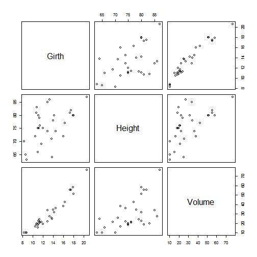 

```r
corrgram(trees, order = TRUE, lower.panel = panel.shade, upper.panel = panel.pie, 
    text.panel = panel.txt, main = "Correlograma")
```

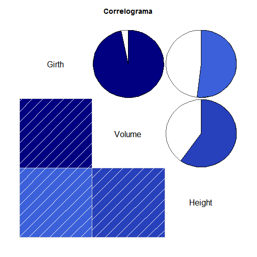 

```r

# Un ejemplo con base de datos más grande
library(datasets)
corrgram(mtcars, order = TRUE, lower.panel = panel.shade, upper.panel = panel.pie, 
    text.panel = panel.txt, main = "Car Milage Data in PC2/PC1 Order")
```

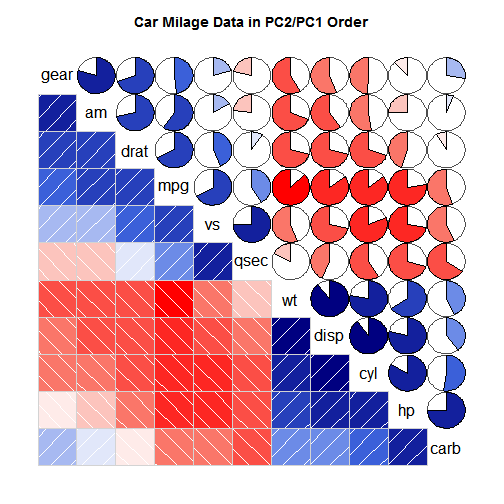 

```r

cor.test(Girth, Volume)
```

```
## 
## 	Pearson's product-moment correlation
## 
## data:  Girth and Volume
## t = 20.48, df = 29, p-value < 2.2e-16
## alternative hypothesis: true correlation is not equal to 0
## 95 percent confidence interval:
##  0.9323 0.9842
## sample estimates:
##    cor 
## 0.9671
```

```r

par(cex.lab = 1.3, cex.axis = 1.3, font.axis = 5, font.lab = 6, cex = 1.3, pch = 16)

## Gráfico de los primeros datos
plot(Volume ~ Girth, xlab = "X", ylab = "Y", main = "Modelo de regresión", pch = 16, 
    cex = 1, cex.lab = 1, cex.axis = 1)
## Estimar la línea de regresión simple
mod <- lm(Volume ~ Girth)
summary(mod)
```

```
## 
## Call:
## lm(formula = Volume ~ Girth)
## 
## Residuals:
##    Min     1Q Median     3Q    Max 
## -8.065 -3.107  0.152  3.495  9.587 
## 
## Coefficients:
##             Estimate Std. Error t value Pr(>|t|)    
## (Intercept)  -36.943      3.365   -11.0  7.6e-12 ***
## Girth          5.066      0.247    20.5  < 2e-16 ***
## ---
## Signif. codes:  0 '***' 0.001 '**' 0.01 '*' 0.05 '.' 0.1 ' ' 1
## 
## Residual standard error: 4.25 on 29 degrees of freedom
## Multiple R-squared:  0.935,	Adjusted R-squared:  0.933 
## F-statistic:  419 on 1 and 29 DF,  p-value: <2e-16
```

```r
abline(mod)
## Adherir segmentos
segments(Girth, fitted(mod), Girth, Volume, lty = 2)
```

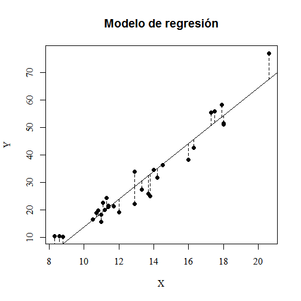 

```r

# Revisión del modelo 1. Linealidad
res <- residuals(mod)
yfit <- fitted(mod)
plot(yfit, res, ylab = "Residuales", xlab = "Ajustados", main = "Residuales vs Ajustados")
abline(lm(res ~ yfit))
```

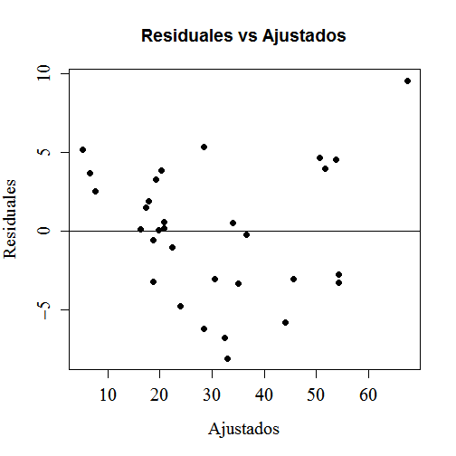 

```r

# 2. Normalidad
library(car)
qq.plot(res, col = "black")
```

```
## Warning: 'qq.plot' is deprecated.
## Use 'qqPlot' instead.
## See help("Deprecated") and help("car-deprecated").
```

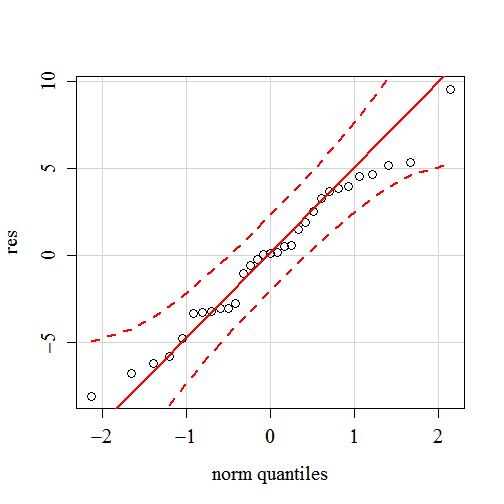 

```r
qqnorm(scale(res))
abline(0, 1)
```

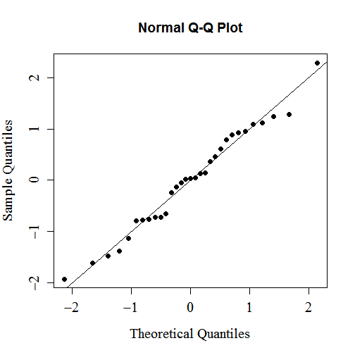 

```r
shapiro.test(res)
```

```
## 
## 	Shapiro-Wilk normality test
## 
## data:  res
## W = 0.9789, p-value = 0.7811
```

```r
############################################################### 
```


### Ejemplo 2

```r
## Importar la base
datos <- read.csv(file = "c:/Curso 1/Rsimple.csv", header = TRUE)
datos
```

```
##      y1   x1 Ypred  res    x2 y2 Ypred.1 res.1
## 1   3.0 54.0   1.2  1.8 0.299 39    29.3   9.7
## 2   4.0 55.0   1.1  2.9 0.224 20    24.7  -4.7
## 3   4.0 52.0   1.4  2.6 0.538 38    43.9  -5.9
## 4   1.0 37.0   2.8 -1.8 0.166 15    21.1  -6.1
## 5   4.0 48.0   1.8  2.2 0.245 25    26.0  -1.0
## 6   1.0 31.8   3.4 -2.4 0.524 49    43.0   6.0
## 7   1.5 42.0   2.4 -0.9 0.222 37    24.6  12.4
## 8   2.0 48.0   1.8  0.2 0.024 24    12.5  11.5
## 9   2.0 44.0   2.2 -0.2 0.349 24    32.3  -8.3
## 10  5.0  7.7   5.7 -0.7 0.306 30    29.7   0.3
## 11  3.0 18.2   4.7 -1.7 0.170 16    21.4  -5.4
## 12  3.0 17.1   4.8 -1.8 0.210 27    23.8   3.2
## 13  3.0 45.0   2.1  0.9 0.195 18    22.9  -4.9
## 14  3.0 18.3   4.7 -1.7 0.166 17    21.2  -4.2
## 15  3.0 24.0   4.1 -1.1 0.182 27    22.1   4.9
## 16  4.0  6.8   5.8 -1.8 0.186 24    22.4   1.6
## 17  2.0 25.0   4.0 -2.0 0.205 21    23.6  -2.6
## 18  2.0 23.0   4.2 -2.2 0.120 19    18.4   0.6
## 19  2.0 27.0   3.8 -1.8 0.311 39    30.0   9.0
## 20 10.0  4.6   6.0  4.0 0.157 18    20.6  -2.6
## 21  4.0 17.5   4.7 -0.7 0.289 35    28.6   6.4
## 22  4.0  8.4   5.6 -1.6 0.236 15    25.4 -10.4
## 23  5.0  3.1   6.1 -1.1 0.284 40    28.3  11.7
## 24  4.0 11.3   5.3 -1.3 0.438 31    37.7  -6.7
## 25  4.0 10.4   5.4 -1.4 0.399 36    35.4   0.6
## 26  2.0 21.6   4.3 -2.3 0.261 27    27.0   0.0
## 27  5.0  9.0   5.6 -0.6 0.369 37    33.5   3.5
## 28  5.0  6.6   5.8 -0.8 0.193 19    22.8  -3.8
## 29  5.0  8.8   5.6 -0.6 0.142 20    19.7   0.3
## 30  5.0  1.3   6.3 -1.3 0.293 32    28.9   3.1
## 31  5.0  7.8   5.7 -0.7 0.343 41    32.0   9.0
## 32  5.0  7.9   5.7 -0.7 0.176 25    21.8   3.2
## 33  6.0  3.0   6.1 -0.1 0.102 17    17.3  -0.3
## 34  6.0  0.2   6.4 -0.4 0.169 14    21.3  -7.3
## 35  6.0  7.8   5.7  0.3 0.194 19    22.9  -3.9
## 36  7.0  4.6   6.0  1.0 0.208 29    23.7   5.3
## 37  7.0  1.1   6.3  0.7 0.348 39    32.2   6.8
## 38  7.0  9.7   5.5  1.5 0.125 14    18.7  -4.7
## 39  8.0  0.1   6.4  1.6 0.060 16    14.7   1.3
## 40  8.0  4.2   6.0  2.0 0.224 20    24.7  -4.7
## 41  9.0  3.4   6.1  2.9 0.171 14    21.5  -7.5
## 42 11.0  0.3   6.4  4.6 0.216 20    24.2  -4.2
## 43 11.0  0.4   6.4  4.6 0.431 26    37.3 -11.3
```

```r
names(datos)
```

```
## [1] "y1"      "x1"      "Ypred"   "res"     "x2"      "y2"      "Ypred.1"
## [8] "res.1"
```

```r
attach(datos)
```

```
## The following object is masked _by_ .GlobalEnv:
## 
##     res
```

```r

par(cex.lab = 1.3, cex.axis = 1.3, font.axis = 5, font.lab = 6, cex = 1.3, pch = 16)

## Gráfico de los primeros datos
plot(x2, y2, xlab = "X", ylab = "Y", main = "Modelo de regresión", pch = 16, 
    cex = 1, cex.lab = 1, cex.axis = 1)
## Estimar la línea de regresión simple
mod <- lm(y2 ~ x2)
summary(mod)
```

```
## 
## Call:
## lm(formula = y2 ~ x2)
## 
## Residuals:
##     Min      1Q  Median      3Q     Max 
## -11.326  -4.695   0.048   4.163  12.427 
## 
## Coefficients:
##             Estimate Std. Error t value Pr(>|t|)    
## (Intercept)    11.03       2.32    4.76  2.4e-05 ***
## x2             61.02       8.66    7.04  1.4e-08 ***
## ---
## Signif. codes:  0 '***' 0.001 '**' 0.01 '*' 0.05 '.' 0.1 ' ' 1
## 
## Residual standard error: 6.31 on 41 degrees of freedom
## Multiple R-squared:  0.548,	Adjusted R-squared:  0.537 
## F-statistic: 49.6 on 1 and 41 DF,  p-value: 1.43e-08
```

```r
abline(mod)
## Adherir segmentos
segments(x2, fitted(mod), x2, y2, lty = 2)
```

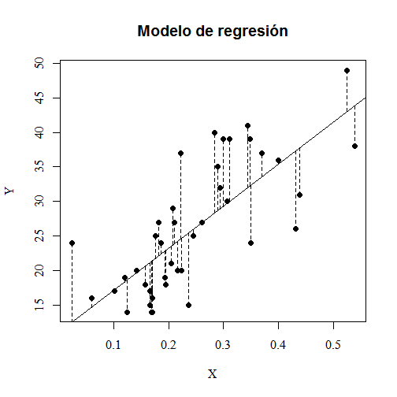 

```r

# Revisión del modelo 1. Linealidad
res <- residuals(mod)
yfit <- fitted(mod)
plot(yfit, res, ylab = "Residuales", xlab = "Ajustados", main = "Residuales vs Ajustados")
abline(lm(res ~ yfit))
```

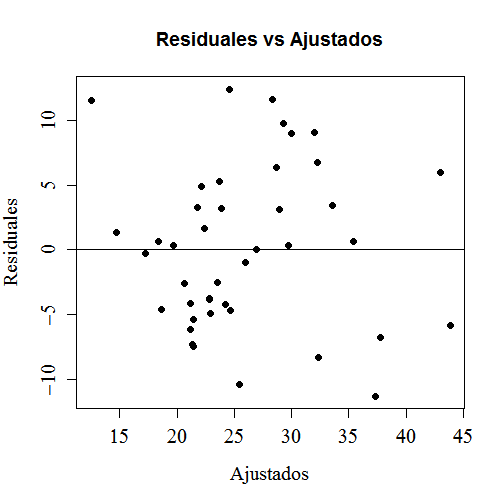 

```r

# 2. Normalidad
library(car)
qq.plot(res, col = "black")
```

```
## Warning: 'qq.plot' is deprecated.
## Use 'qqPlot' instead.
## See help("Deprecated") and help("car-deprecated").
```

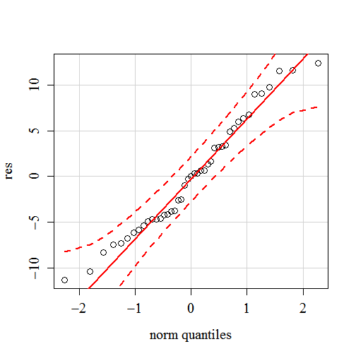 

```r
qqnorm(scale(res))
abline(0, 1)
```

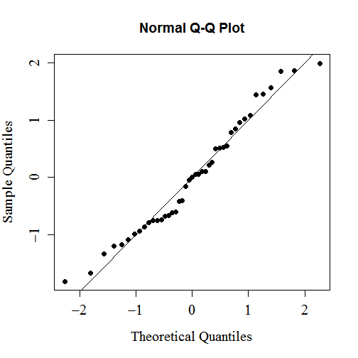 

```r
shapiro.test(res)
```

```
## 
## 	Shapiro-Wilk normality test
## 
## data:  res
## W = 0.9669, p-value = 0.2461
```

```r

# 3. Homoscedasticidad
plot(yfit, abs(res), ylab = "Residuales", xlab = "Ajustados", main = "Residuales (ABS) vs Ajustados")
g <- lm(abs(res) ~ yfit)
abline(g)
```

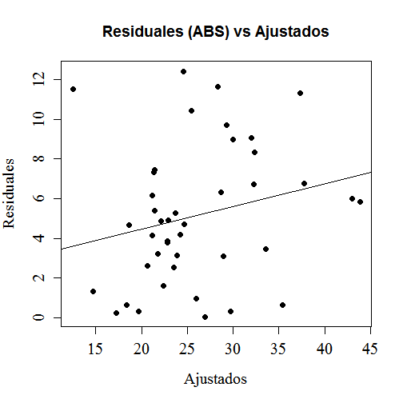 

```r
summary(g)
```

```
## 
## Call:
## lm(formula = abs(res) ~ yfit)
## 
## Residuals:
##    Min     1Q Median     3Q    Max 
## -5.592 -2.358 -0.304  2.006  7.905 
## 
## Coefficients:
##             Estimate Std. Error t value Pr(>|t|)
## (Intercept)   2.1768     2.0431    1.07     0.29
## yfit          0.1143     0.0764    1.50     0.14
## 
## Residual standard error: 3.39 on 41 degrees of freedom
## Multiple R-squared:  0.0518,	Adjusted R-squared:  0.0287 
## F-statistic: 2.24 on 1 and 41 DF,  p-value: 0.142
```

```r

# 4. Outliers
library(outliers)
help(dixon.test)
```

```
## starting httpd help server ... done
```

```r
library(car)
outlier.test(mod)  ##Prueba de
```

```
## Warning: 'outlier.test' is deprecated.
## Use 'outlierTest' instead.
## See help("Deprecated") and help("car-deprecated").
```

```
## 
## No Studentized residuals with Bonferonni p < 0.05
## Largest |rstudent|:
##   rstudent unadjusted p-value Bonferonni p
## 7    2.073            0.04468           NA
```

```r
help(outlier.test)
plot(mod)
```

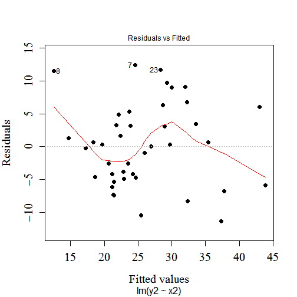 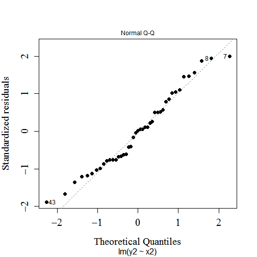 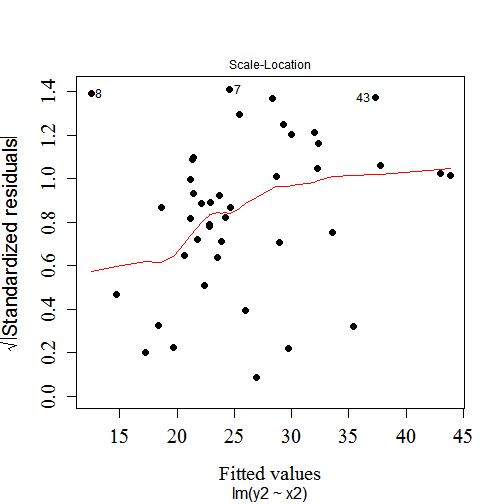 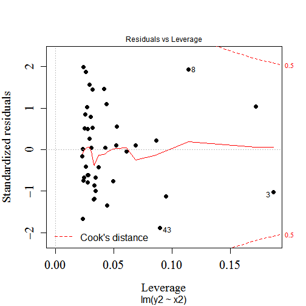 

```r
############################################################### 
```


## Regresión Polinomial 

```r
################################################################################ Regresión polinomial #########################################

plot(x1, y1, xlab = "X", ylab = "Y", main = "Regresión cuadrática", pch = 16, 
    cex = 1.2, cex.lab = 1.5, cex.axis = 1.5, cex.main = 1.5)
modx <- lm(y1 ~ x1 + I(x1^2) + I(x1^3))
summary(modx)  ## Se puede simplificar el modelo?
```

```
## 
## Call:
## lm(formula = y1 ~ x1 + I(x1^2) + I(x1^3))
## 
## Residuals:
##    Min     1Q Median     3Q    Max 
## -2.832 -0.673 -0.179  0.575  3.449 
## 
## Coefficients:
##              Estimate Std. Error t value Pr(>|t|)    
## (Intercept)  8.38e+00   5.00e-01   16.75  < 2e-16 ***
## x1          -4.32e-01   1.02e-01   -4.22  0.00014 ***
## I(x1^2)      7.53e-03   4.93e-03    1.53  0.13487    
## I(x1^3)     -2.06e-05   6.30e-05   -0.33  0.74554    
## ---
## Signif. codes:  0 '***' 0.001 '**' 0.01 '*' 0.05 '.' 0.1 ' ' 1
## 
## Residual standard error: 1.35 on 39 degrees of freedom
## Multiple R-squared:  0.737,	Adjusted R-squared:  0.717 
## F-statistic: 36.4 on 3 and 39 DF,  p-value: 2.16e-11
```

```r
## Remover algunos de los términos no significativos

modx <- lm(y1 ~ x1 + I(x1^2))  ## Regresión polinomial simplificada
summary(modx)
```

```
## 
## Call:
## lm(formula = y1 ~ x1 + I(x1^2))
## 
## Residuals:
##    Min     1Q Median     3Q    Max 
## -2.774 -0.609 -0.179  0.522  3.438 
## 
## Coefficients:
##              Estimate Std. Error t value Pr(>|t|)    
## (Intercept)  8.286604   0.403237   20.55  < 2e-16 ***
## x1          -0.402337   0.046506   -8.65  1.1e-10 ***
## I(x1^2)      0.005947   0.000875    6.80  3.6e-08 ***
## ---
## Signif. codes:  0 '***' 0.001 '**' 0.01 '*' 0.05 '.' 0.1 ' ' 1
## 
## Residual standard error: 1.34 on 40 degrees of freedom
## Multiple R-squared:  0.736,	Adjusted R-squared:  0.723 
## F-statistic: 55.8 on 2 and 40 DF,  p-value: 2.66e-12
```

```r
x <- 0:60
x
```

```
##  [1]  0  1  2  3  4  5  6  7  8  9 10 11 12 13 14 15 16 17 18 19 20 21 22
## [24] 23 24 25 26 27 28 29 30 31 32 33 34 35 36 37 38 39 40 41 42 43 44 45
## [47] 46 47 48 49 50 51 52 53 54 55 56 57 58 59 60
```

```r
y <- predict(modx, list(x1 = x))
y
```

```
##     1     2     3     4     5     6     7     8     9    10    11    12 
## 8.287 7.890 7.506 7.133 6.772 6.424 6.087 5.762 5.449 5.147 4.858 4.580 
##    13    14    15    16    17    18    19    20    21    22    23    24 
## 4.315 4.061 3.819 3.590 3.372 3.165 2.971 2.789 2.619 2.460 2.313 2.179 
##    25    26    27    28    29    30    31    32    33    34    35    36 
## 2.056 1.945 1.846 1.759 1.683 1.620 1.569 1.529 1.501 1.486 1.482 1.490 
##    37    38    39    40    41    42    43    44    45    46    47    48 
## 1.509 1.541 1.585 1.641 1.708 1.787 1.879 1.982 2.097 2.224 2.362 2.513 
##    49    50    51    52    53    54    55    56    57    58    59    60 
## 2.676 2.850 3.037 3.235 3.445 3.667 3.901 4.147 4.405 4.674 4.956 5.249 
##    61 
## 5.555
```

```r
lines(x, y)
```

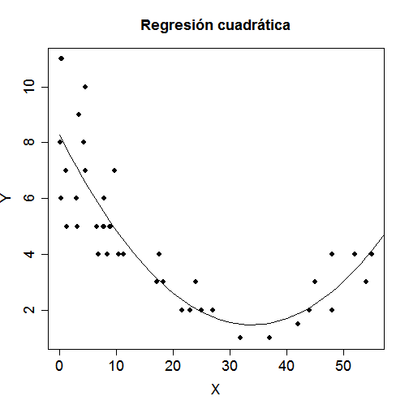 

```r
plot(modx)
```

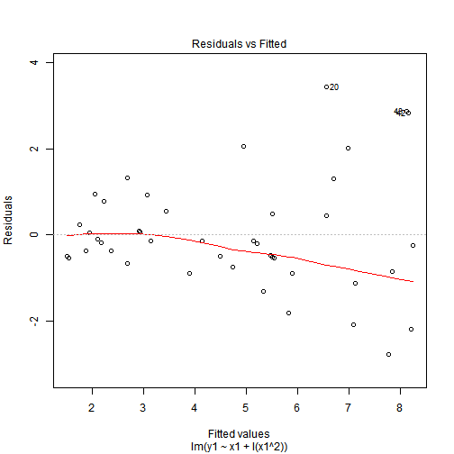 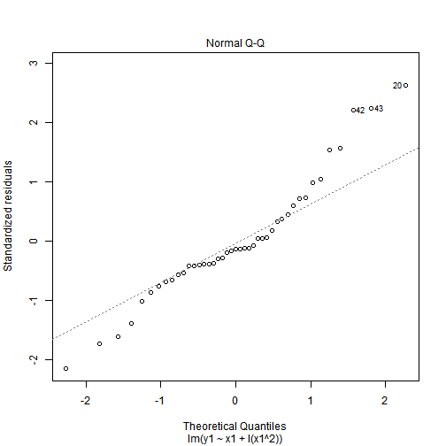 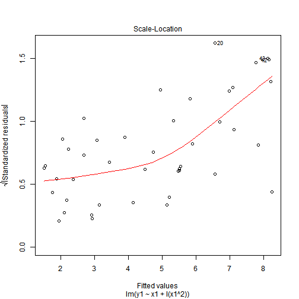 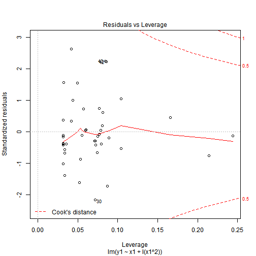 

```r

################################################################################ 
```


## Regresión lineal múltiple y transformación Boxcox

```r
trees <- read.csv("c:/Curso 1/trees.csv")
r1 <- lm(Volume ~ Height + Girth, data = trees)
summary(r1)
```

```
## 
## Call:
## lm(formula = Volume ~ Height + Girth, data = trees)
## 
## Residuals:
##    Min     1Q Median     3Q    Max 
## -6.406 -2.649 -0.288  2.200  8.485 
## 
## Coefficients:
##             Estimate Std. Error t value Pr(>|t|)    
## (Intercept)  -57.988      8.638   -6.71  2.7e-07 ***
## Height         0.339      0.130    2.61    0.014 *  
## Girth          4.708      0.264   17.82  < 2e-16 ***
## ---
## Signif. codes:  0 '***' 0.001 '**' 0.01 '*' 0.05 '.' 0.1 ' ' 1
## 
## Residual standard error: 3.88 on 28 degrees of freedom
## Multiple R-squared:  0.948,	Adjusted R-squared:  0.944 
## F-statistic:  255 on 2 and 28 DF,  p-value: <2e-16
```

```r
plot(trees$Girth, rstandard(r1))
```

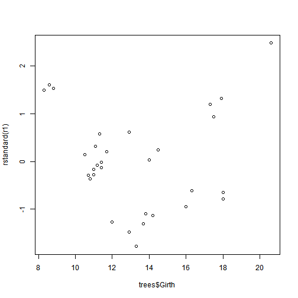 

```r
hist(r1$resid)
```

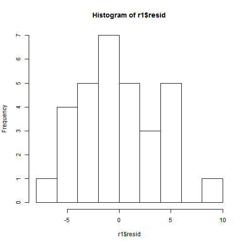 

```r
qqnorm(r1$resid)
qqline(r1$resid)
```

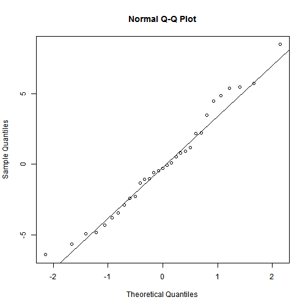 

```r
library(car)
qq.plot(r1$resid)
```

```
## Warning: 'qq.plot' is deprecated.
## Use 'qqPlot' instead.
## See help("Deprecated") and help("car-deprecated").
```

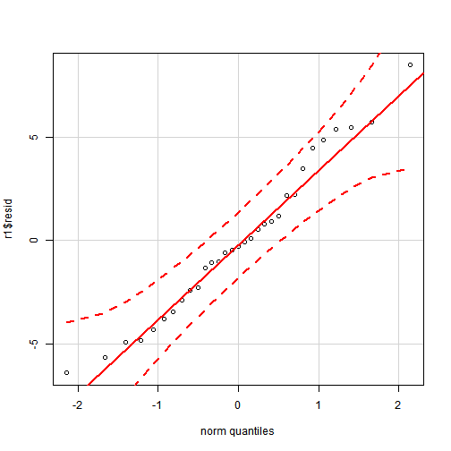 

```r
library(moments)
skewness(r1$resid)
```

```
## [1] 0.3103
```

```r

# A continuación la transformación boxcox
library(MASS)
b <- boxcox(Volume ~ Height + Girth, data = trees)
```

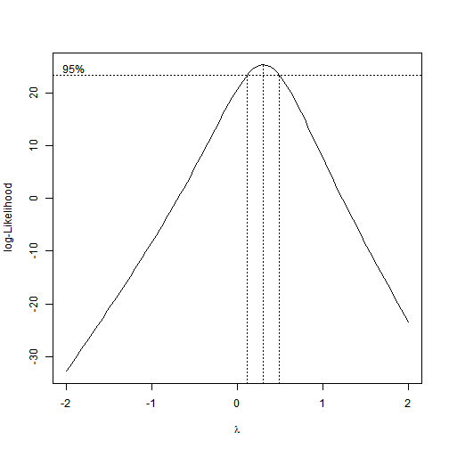 

```r
lambda <- b$x
lik <- b$y
bc <- cbind(lambda, lik)
bc[order(-lik), ]
```

```
##          lambda       lik
##   [1,]  0.30303  25.37387
##   [2,]  0.34343  25.29521
##   [3,]  0.26263  25.26305
##   [4,]  0.38384  25.02960
##   [5,]  0.22222  24.97017
##   [6,]  0.42424  24.58202
##   [7,]  0.18182  24.50591
##   [8,]  0.46465  23.96403
##   [9,]  0.14141  23.88486
##  [10,]  0.50505  23.19222
##  [11,]  0.10101  23.12604
##  [12,]  0.54545  22.28413
##  [13,]  0.06061  22.24871
##  [14,]  0.02020  21.27212
##  [15,]  0.58586  21.25946
##  [16,] -0.02020  20.21542
##  [17,]  0.62626  20.13813
##  [18,] -0.06061  19.09553
##  [19,]  0.66667  18.93818
##  [20,] -0.10101  17.92712
##  [21,]  0.70707  17.67638
##  [22,] -0.14141  16.72385
##  [23,]  0.74747  16.36805
##  [24,] -0.18182  15.49593
##  [25,]  0.78788  15.02511
##  [26,] -0.22222  14.25264
##  [27,]  0.82828  13.65874
##  [28,] -0.26263  13.00124
##  [29,]  0.86869  12.27742
##  [30,] -0.30303  11.74720
##  [31,]  0.90909  10.88803
##  [32,] -0.34343  10.49539
##  [33,]  0.94949   9.49647
##  [34,] -0.38384   9.24895
##  [35,]  0.98990   8.10671
##  [36,] -0.42424   8.01062
##  [37,] -0.46465   6.78229
##  [38,]  1.03030   6.72232
##  [39,] -0.50505   5.56522
##  [40,]  1.07071   5.34567
##  [41,] -0.54545   4.36041
##  [42,]  1.11111   3.97851
##  [43,] -0.58586   3.16831
##  [44,]  1.15152   2.62223
##  [45,] -0.62626   1.98924
##  [46,]  1.19192   1.27751
##  [47,] -0.66667   0.82324
##  [48,]  1.23232  -0.05507
##  [49,] -0.70707  -0.32981
##  [50,]  1.27273  -1.37533
##  [51,] -0.74747  -1.47012
##  [52,] -0.78788  -2.59804
##  [53,]  1.31313  -2.68327
##  [54,] -0.82828  -3.71395
##  [55,]  1.35354  -3.97900
##  [56,] -0.86869  -4.81828
##  [57,]  1.39394  -5.26282
##  [58,] -0.90909  -5.91151
##  [59,]  1.43434  -6.53506
##  [60,] -0.94949  -6.99412
##  [61,]  1.47475  -7.79614
##  [62,] -0.98990  -8.06660
##  [63,]  1.51515  -9.04651
##  [64,] -1.03030  -9.12946
##  [65,] -1.07071 -10.18319
##  [66,]  1.55556 -10.28666
##  [67,] -1.11111 -11.22827
##  [68,]  1.59596 -11.51709
##  [69,] -1.15152 -12.26518
##  [70,]  1.63636 -12.73831
##  [71,] -1.19192 -13.29438
##  [72,]  1.67677 -13.95082
##  [73,] -1.23232 -14.31632
##  [74,]  1.71717 -15.15513
##  [75,] -1.27273 -15.33141
##  [76,] -1.31313 -16.34007
##  [77,]  1.75758 -16.35173
##  [78,] -1.35354 -17.34271
##  [79,]  1.79798 -17.54109
##  [80,] -1.39394 -18.33969
##  [81,]  1.83838 -18.72369
##  [82,] -1.43434 -19.33137
##  [83,]  1.87879 -19.89997
##  [84,] -1.47475 -20.31810
##  [85,]  1.91919 -21.07033
##  [86,] -1.51515 -21.30020
##  [87,]  1.95960 -22.23522
##  [88,] -1.55556 -22.27798
##  [89,] -1.59596 -23.25174
##  [90,]  2.00000 -23.39506
##  [91,] -1.63636 -24.22176
##  [92,] -1.67677 -25.18830
##  [93,] -1.71717 -26.15161
##  [94,] -1.75758 -27.11193
##  [95,] -1.79798 -28.06948
##  [96,] -1.83838 -29.02449
##  [97,] -1.87879 -29.97714
##  [98,] -1.91919 -30.92763
##  [99,] -1.95960 -31.87613
## [100,] -2.00000 -32.82285
```

```r

r2 <- lm(Volume^(1/3) ~ Height + Girth, data = trees)
summary(r2)
```

```
## 
## Call:
## lm(formula = Volume^(1/3) ~ Height + Girth, data = trees)
## 
## Residuals:
##      Min       1Q   Median       3Q      Max 
## -0.15960 -0.05020 -0.00683  0.06965  0.13398 
## 
## Coefficients:
##             Estimate Std. Error t value Pr(>|t|)    
## (Intercept) -0.08539    0.18431   -0.46     0.65    
## Height       0.01447    0.00278    5.21  1.6e-05 ***
## Girth        0.15152    0.00564   26.87  < 2e-16 ***
## ---
## Signif. codes:  0 '***' 0.001 '**' 0.01 '*' 0.05 '.' 0.1 ' ' 1
## 
## Residual standard error: 0.0828 on 28 degrees of freedom
## Multiple R-squared:  0.978,	Adjusted R-squared:  0.976 
## F-statistic:  612 on 2 and 28 DF,  p-value: <2e-16
```

```r
plot(trees$Girth, rstandard(r2))
```

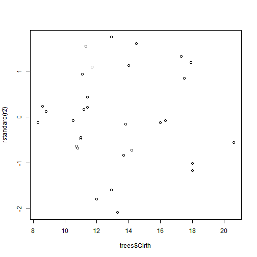 

```r
hist(r2$resid)
```

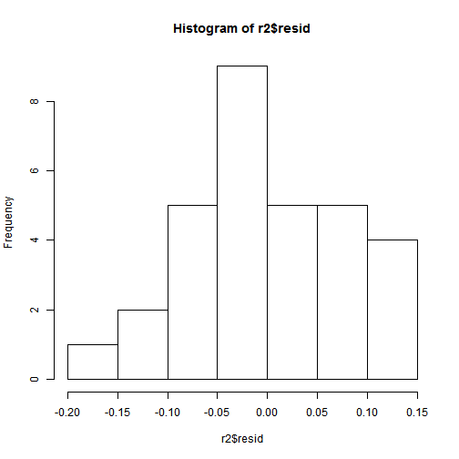 

```r
qqnorm(r2$resid)
qqline(r2$resid)
```

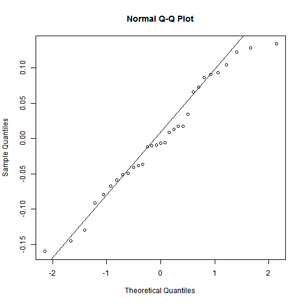 

```r
library(car)
qq.plot(r2$resid)
```

```
## Warning: 'qq.plot' is deprecated.
## Use 'qqPlot' instead.
## See help("Deprecated") and help("car-deprecated").
```

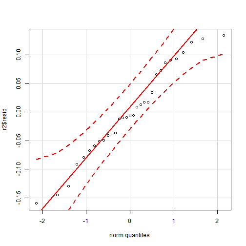 

```r
library(moments)
skewness(r2$resid)
```

```
## [1] -0.06992
```


## Regresión no lineal

```r
Nha <- read.csv("c:/Curso 1/na.csv", header = T)
head(Nha)
```

```
##      dq   na
## 1 14.03 2420
## 2 12.89 3084
## 3  7.53 7130
## 4 10.17 4966
## 5 21.09 1210
## 6 19.05 1503
```

```r
library(car)
Nha.mod <- nls((na ~ theta1 * (dq^theta2)), start = list(theta1 = 70, theta2 = 1), 
    data = Nha, trace = TRUE)
```

```
## 221245871 :  70  1
## 129282988 :  433.9770  -0.6428
## 129148781 :  828.9587  -0.8816
## 128618091 :  1478.858   -1.078
## 128065143 :  3341.006   -1.373
## 125877629 :  9040.957   -1.682
## 111588658 :  22656.349    -1.699
## 85581579 :  48104.34    -1.69
## 49638664 :  92739.890    -1.693
## 14532259 :  159632.990     -1.692
## 2892738 :  226559.909     -1.692
## 2892731 :  226547.756     -1.692
## 2892731 :  226552.256     -1.692
```

```r
summary(Nha.mod)
```

```
## 
## Formula: na ~ theta1 * (dq^theta2)
## 
## Parameters:
##         Estimate Std. Error t value Pr(>|t|)    
## theta1  2.27e+05   2.81e+04    8.08  4.4e-10 ***
## theta2 -1.69e+00   4.98e-02  -33.95  < 2e-16 ***
## ---
## Signif. codes:  0 '***' 0.001 '**' 0.01 '*' 0.05 '.' 0.1 ' ' 1
## 
## Residual standard error: 262 on 42 degrees of freedom
## 
## Number of iterations to convergence: 12 
## Achieved convergence tolerance: 1.85e-06
```

```r
coef(Nha.mod)
```

```
##     theta1     theta2 
## 226552.256     -1.692
```

```r
confint(Nha.mod)
```

```
## Waiting for profiling to be done...
```

```
## 3451292 :  -1.692
## 2915219 :  -1.665
## 2914267 :  -1.666
## 2914267 :  -1.666
## 2980776 :  -1.641
## 2978905 :  -1.64
## 2978904 :  -1.64
## 3088381 :  -1.616
## 3086544 :  -1.614
## 3086544 :  -1.614
## 3238898 :  -1.59
## 3237094 :  -1.589
## 3237094 :  -1.589
## 3432247 :  -1.565
## 3430470 :  -1.563
## 3430470 :  -1.563
## 3451292 :  -1.692
## 2912053 :  -1.716
## 2911545 :  -1.717
## 2911545 :  -1.717
## 2964682 :  -1.742
## 2963305 :  -1.74
## 2963305 :  -1.74
## 3049546 :  -1.765
## 3048225 :  -1.764
## 3048225 :  -1.764
## 3167509 :  -1.79
## 3166158 :  -1.788
## 3166158 :  -1.788
## 3318420 :  -1.814
## 3317038 :  -1.812
## 3317038 :  -1.812
## 3502203 :  -1.838
## 3500788 :  -1.837
## 3500788 :  -1.837
## 3416035 :  226552
## 2912675 :  241362
## 2970723 :  255728
## 2969354 :  256549
## 3064109 :  271893
## 3062771 :  272756
## 3194223 :  289135
## 3192861 :  290062
## 3360956 :  307559
## 3359567 :  308555
## 3564253 :  327264
## 3562834 :  328336
## 3492457 :  226552
## 2913075 :  212559
## 2973428 :  199120
## 2971639 :  199851
## 3070073 :  187262
## 3068364 :  187934
## 3204890 :  176120
## 3203201 :  176749
## 3377767 :  165655
## 3376094 :  166244
```

```
##              2.5%      97.5%
## theta1 178143.329 288912.162
## theta2     -1.791     -1.597
```

```r
plot(resid(Nha.mod))
```

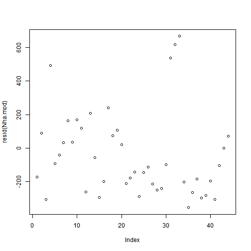 

```r
plot(fitted(Nha.mod))
```

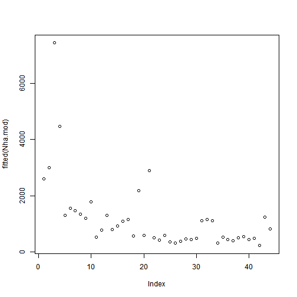 

```r
predict(Nha.mod, newdata = x1)
```

```
##  [1] 2595.0 2995.1 7438.2 4472.9 1301.9 1546.5 1472.5 1341.5 1203.7 1776.7
## [11]  529.7  773.9 1295.7  790.6  934.2 1093.5 1161.6  564.7 2185.2  584.6
## [21] 2888.1  510.1  424.3  591.7  368.4  324.8  386.9  471.4  444.5  480.3
## [31] 1116.0 1163.4 1113.6  312.9  517.2  438.0  397.1  511.0  555.2  438.9
## [41]  487.6  227.1 1238.7  814.8
```

```r
logLik(Nha.mod)
```

```
## 'log Lik.' -306.5 (df=3)
```

```r

plot(Nha, main = "na = b0*dq^b1", ylab = "N de árboles por ha", xlab = "Diámetro medio cuadrático", 
    col = "black")
with(data = Nha, lines(seq(0, 60, by = 1), predict(Nha.mod, data.frame(dq = seq(0, 
    60, by = 1))), lwd = 1, col = "red"))
panel.first = grid()
```

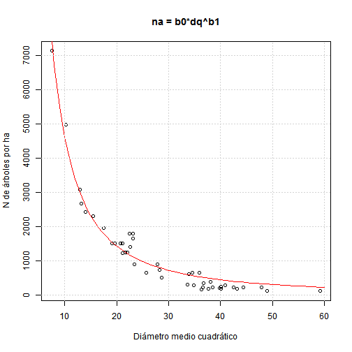 


