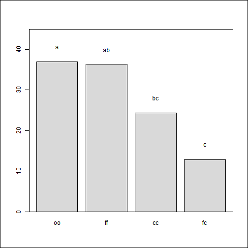

 
# Estadística Básica con R y RStudio
> En este curso se utiliza el software de licencia libre R v3.0 o superior, el cual constituye un lenguaje de programación muy simple, de elegante representación gráfica y con alto grado de didáctica. El curso está diseñado en seis módulos principales, más un módulo extra sobre normalidad
> -	[Módulo 1. Introducción al software R y R-Studio, funciones básicas para familiarización](https://github.com/rubio-e/Curso_R/blob/main/README.md#m1-introducci%C3%B3n-al-r-generalidades)
> -	[Módulo 2. Gráficos](https://github.com/rubio-e/Curso_R/blob/main/README.md#m2-gr%C3%A1ficos)
> -	[Módulo 3. Estadística descriptiva](https://github.com/rubio-e/Curso_R/blob/main/README.md#m3-estad%C3%ADstica-descriptiva)
> -	[Módulo 4. Pruebas de hipótesis](https://github.com/rubio-e/Curso_R/blob/main/README.md#m4-pruebas-de-hip%C3%B3tesis)
> -	[Módulo 5. ANOVA](https://github.com/rubio-e/Curso_R/blob/main/README.md#m5-anova)
> -	[Módulo 6. Regresión](https://github.com/rubio-e/Curso_R/blob/main/README.md#m6-regresi%C3%B3n)
> -	[NORMALIDAD](https://github.com/rubio-e/Curso_R/blob/main/README.md#normalidad)
## Se recomienda seguir el siguiente orden 
### [M1 Introducción al R: generalidades](https://github.com/rubio-e/Curso_R/blob/main/M1.md)
- ¿Que es el R-statistics?
- Utilización de comandos simples
- Uso de los vectores
- Uso de las secuencias
- Uso los operadores
- Operaciones entre asignaciones
- Variables y asignaciones de texto
- Uso de la función help
- [Entrada y tipos de datos](https://github.com/rubio-e/Curso_R/blob/main/M1.md#entrada-y-tipos-de-datos)
   - Tipo de datos
      - Vectores
      - Matrices
      - Marco de datos (data.frame)
      - Listas
- [Importación de datos](https://github.com/rubio-e/Curso_R/blob/main/M1.md#importaci%C3%B3n-de-datos)
   - A partir de SPSS
   - A partir de SAS
   - A partir de SYSTAT
   - A partir de EXCEL
   - A partir de .txt
   - A partir de .csv 
### [M2 Gráficos](https://github.com/rubio-e/Curso_R/blob/main/M2.md)
- Funciones básicas de gráficos
- Gráficos de dispersión
- Línk de parámetros gráficos en R
- Gráficos de barra
- Distribución de los gráficos en mosaico
- Gráficos de puntos
- Gráficos de líneas
- Gráficos de densidad e histográmas
- Gráficos de caja
- Gráficos con LATTICE
### [M3 Estadística Descriptiva](https://github.com/rubio-e/Curso_R/blob/main/M3.md)
- [Medidas de tendencia central](https://github.com/rubio-e/Curso_R/blob/main/M3.md#medidas-de-tendencia-central)
- [Medidas de dispersión](https://github.com/rubio-e/Curso_R/blob/main/M3.md#medidas-de-dispersi%C3%B3n)
   - [Estadística descriptiva con bases de datos](https://github.com/rubio-e/Curso_R/blob/main/M3.md#estad%C3%ADstica-descriptiva-con-bases-de-datos)
      - Cálculo directo de las estadísticas básicas
      - Uso de las función "tapply" para bases de datos por grupo
      - Uso del paquete "doBy" para bases de datos
      - Uso de la librería LATTICE para gráficos apilados
- [Probabilidad y teoría de distribuciones](https://github.com/rubio-e/Curso_R/blob/main/M3.md#probabilidad-y-teor%C3%ADa-de-distribuciones)
   - Distribución normal y función acumulativa
   - Distribución de medias
     - Intervalos de confianza distribución normal
     - Intervalos de confianza distribución t de student
    - Librería doBy y el cálculo de los intervalos de confianza en la distribución normal Z 

### [M4 Pruebas de Hipótesis](https://github.com/rubio-e/Curso_R/blob/main/M4.md)
- Prueba de hipótesis en caballos 
- Prueba de z mediante el paquete BSDA
- Prueba de t de estudent
   - Hipótesis de dos colas para la media de la población 
- Hipótesis de una cola
- Comparación entre las medias de dos poblaciones
   - Prueba Z
   - Prueba de t para dos muestras independientes
   - Cálculo del poder de la prueba de t de dos poblaciones
### [M5 ANOVA](https://github.com/rubio-e/Curso_R/blob/main/M5.md)
- Anova unifactorial paso a paso
- ANOVA se puede calcular de varias formas en R
- Otro ejemplo con el aov más gráficos
- Uso de la librería agricolae
- Modelo multifactorial
### [M6 Regresión](https://github.com/rubio-e/Curso_R/blob/main/M6.md)
- Regresión lineal simple
   - Ejemplo 1
   - Ejemplo 2
- Regresión Polinomial
- Regresión lineal múltiple y transformación Boxcox
- Regresión no lineal
### [Normalidad](https://github.com/rubio-e/Curso_R/blob/main/NORMALIDAD.md)
- Gráficos de exploración de datos
- Gráficos de normalidad
   - Histograma
- Utilizar el paquete CAR más la función qq.plot
   - qqplot
- Pruebas de normalidad
- Transformación de variables
### [Bases de datos](https://github.com/rubio-e/Bases)
Acceso a las bases de datos utilizadas en el curso: https://github.com/rubio-e/Bases

